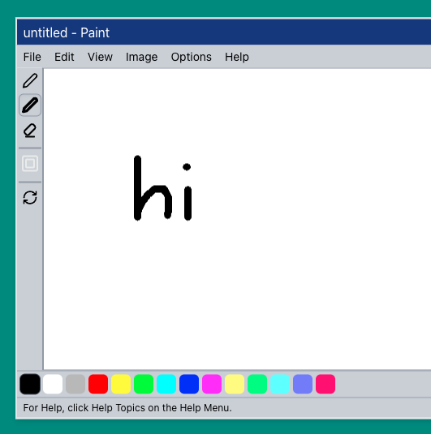
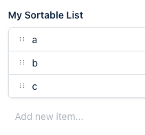
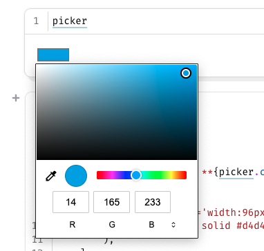
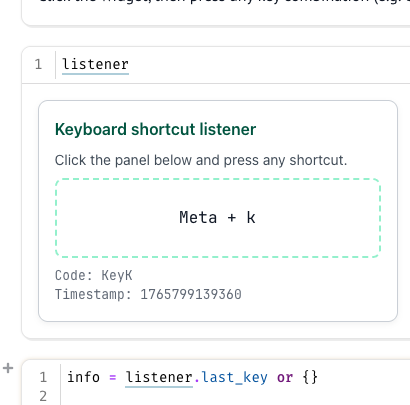
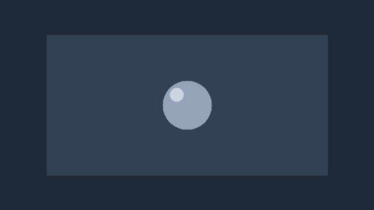
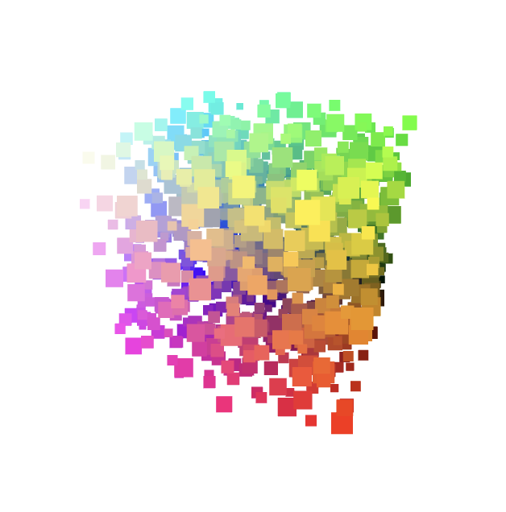
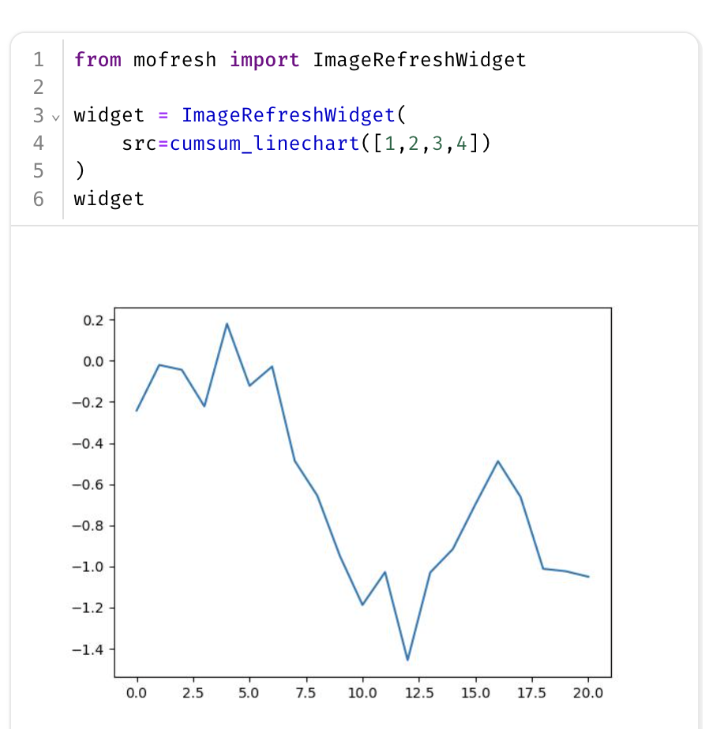
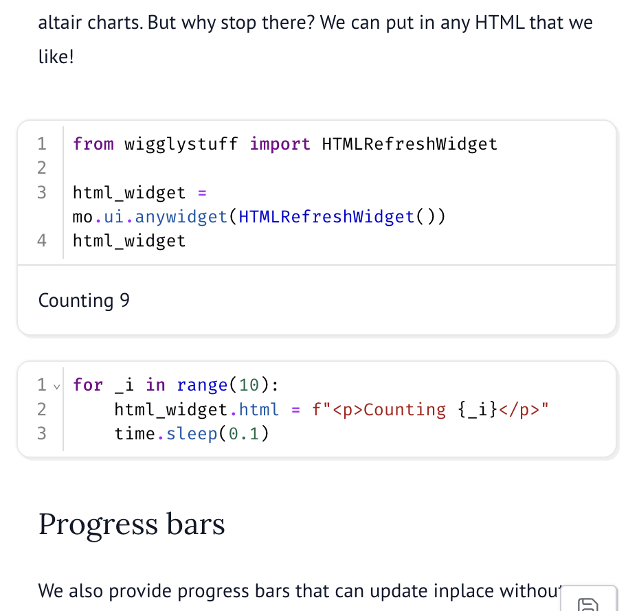
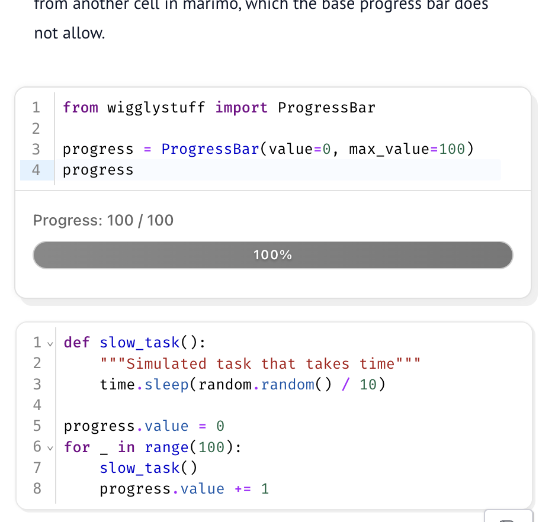

# wigglystuff 

> "A collection of creative AnyWidgets for Python notebook environments."

The project uses [anywidget](https://anywidget.dev/) under the hood so our tools should work in [marimo](https://marimo.io/), [Jupyter](https://jupyter.org/), [Shiny for Python](https://shiny.posit.co/py/docs/jupyter-widgets.html), [VSCode](https://code.visualstudio.com/docs/datascience/jupyter-notebooks), [Colab](https://colab.google/), [Solara](https://solara.dev/), etc. Because of the anywidget integration you should also be able interact with [ipywidgets](https://ipywidgets.readthedocs.io/en/stable/) natively. 

## Install 

```
uv pip install wigglystuff
```

## Widget Gallery

<table>
<tr>
<td align="center"><b>Slider2D</b><br><br><a href="./demos/slider2d.py">Demo</a> · <a href="./wigglystuff/slider2d.py">Source</a></td>
<td align="center"><b>Matrix</b><br><br><a href="./demos/matrix.py">Demo</a> · <a href="./wigglystuff/matrix.py">Source</a></td>
<td align="center"><b>Paint</b><br><br><a href="./demos/paint.py">Demo</a> · <a href="./wigglystuff/paint.py">Source</a></td>
</tr>
<tr>
<td align="center"><b>EdgeDraw</b><br><br><a href="./demos/edgedraw.py">Demo</a> · <a href="./wigglystuff/edge_draw.py">Source</a></td>
<td align="center"><b>SortableList</b><br><br><a href="./demos/sortlist.py">Demo</a> · <a href="./wigglystuff/sortable_list.py">Source</a></td>
<td align="center"><b>ColorPicker</b><br><br><a href="./demos/colorpicker.py">Demo</a> · <a href="./wigglystuff/color_picker.py">Source</a></td>
</tr>
<tr>
<td align="center"><b>GamepadWidget</b><br><br><a href="./demos/gamepad.py">Demo</a> · <a href="./wigglystuff/gamepad.py">Source</a></td>
<td align="center"><b>KeystrokeWidget</b><br><br><a href="./demos/keystroke.py">Demo</a> · <a href="./wigglystuff/keystroke.py">Source</a></td>
<td align="center"><b>SpeechToText</b><br><br><a href="./demos/talk.py">Demo</a> · <a href="./wigglystuff/talk.py">Source</a></td>
</tr>
<tr>
<td align="center"><b>CopyToClipboard</b><br><br><a href="./demos/copytoclipboard.py">Demo</a> · <a href="./wigglystuff/copy_to_clipboard.py">Source</a></td>
<td align="center"><b>CellTour</b><br><br><a href="./demos/celltour.py">Demo</a> · <a href="./wigglystuff/cell_tour.py">Source</a></td>
<td align="center"><b>WebcamCapture</b><br><br><a href="./demos/webcam_capture.py">Demo</a> · <a href="./wigglystuff/webcam_capture.py">Source</a></td>
</tr>
<tr>
<td align="center"><b>ThreeWidget</b><br><br><a href="./demos/threewidget.py">Demo</a> · <a href="./wigglystuff/three_widget.py">Source</a></td>
<td align="center"><b>ImageRefreshWidget</b><br><br><a href="./demos/html.py">Demo</a> · <a href="./wigglystuff/html.py">Source</a></td>
<td align="center"><b>HTMLRefreshWidget</b><br><br><a href="./demos/html.py">Demo</a> · <a href="./wigglystuff/html.py">Source</a></td>
</tr>
<tr>
<td align="center"><b>ProgressBar</b><br><br><a href="./demos/html.py">Demo</a> · <a href="./wigglystuff/html.py">Source</a></td>
<td align="center"></td>
<td align="center"></td>
</tr>
</table>
