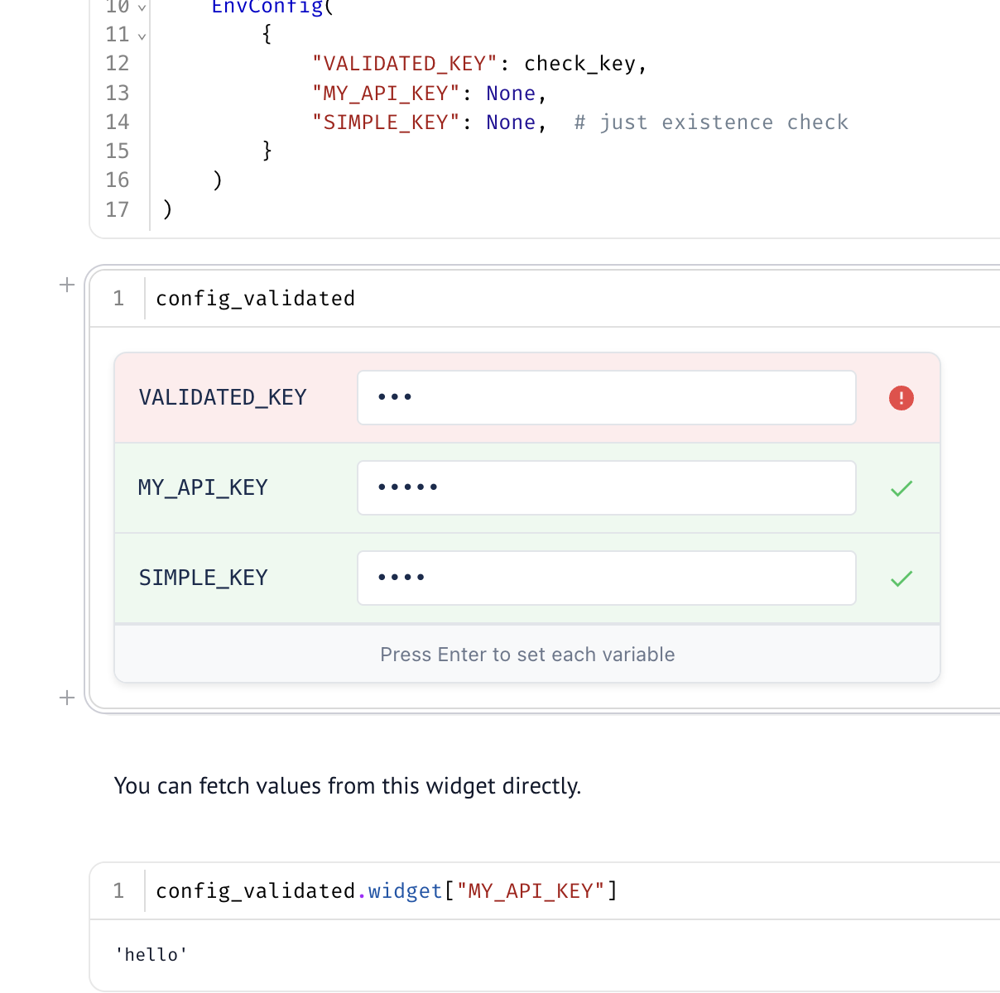
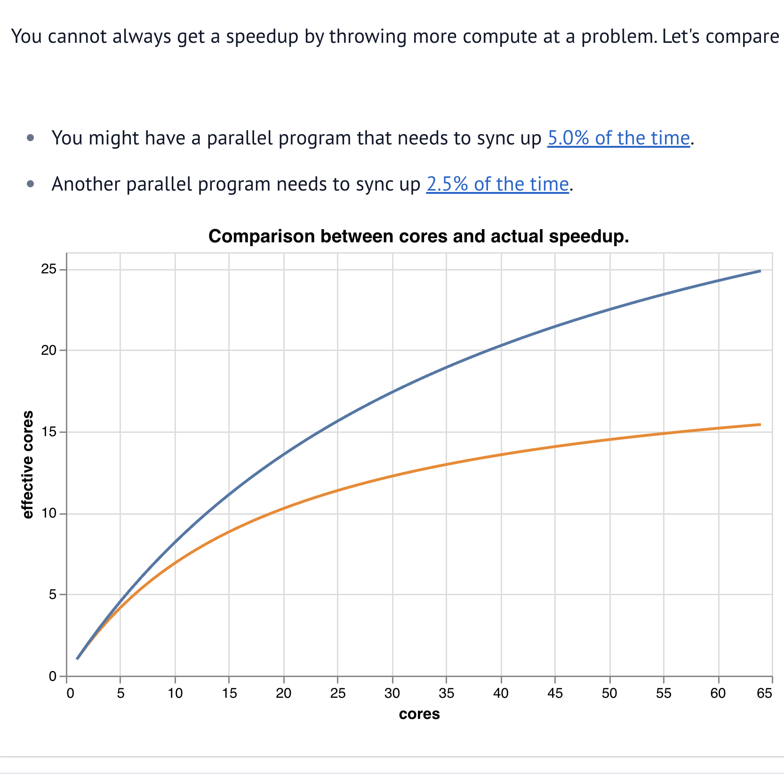
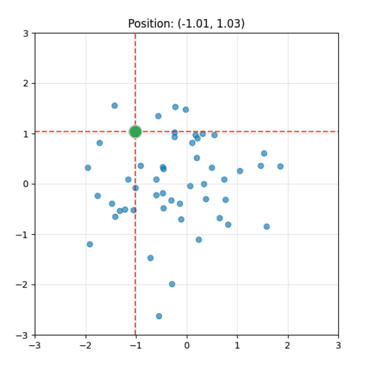

# wigglystuff 

> "A collection of creative AnyWidgets for Python notebook environments."

The project uses [anywidget](https://anywidget.dev/) under the hood so our tools should work in [marimo](https://marimo.io/), [Jupyter](https://jupyter.org/), [Shiny for Python](https://shiny.posit.co/py/docs/jupyter-widgets.html), [VSCode](https://code.visualstudio.com/docs/datascience/jupyter-notebooks), [Colab](https://colab.google/), [Solara](https://solara.dev/), etc. Because of the anywidget integration you should also be able interact with [ipywidgets](https://ipywidgets.readthedocs.io/en/stable/) natively. 

## Install 

```
uv pip install wigglystuff
```

## Widget Gallery

<table>
<tr>
<td align="center"><b>Slider2D</b><br><a href="https://koaning.github.io/wigglystuff/examples/slider2d/"></a><br><a href="https://koaning.github.io/wigglystuff/examples/slider2d/">Demo</a> · <a href="https://koaning.github.io/wigglystuff/reference/slider2d/">API</a> · <a href="https://github.com/koaning/wigglystuff/blob/main/mkdocs/reference/slider2d.md">MD</a></td>
<td align="center"><b>Matrix</b><br><a href="https://koaning.github.io/wigglystuff/examples/matrix/"></a><br><a href="https://koaning.github.io/wigglystuff/examples/matrix/">Demo</a> · <a href="https://koaning.github.io/wigglystuff/reference/matrix/">API</a> · <a href="https://github.com/koaning/wigglystuff/blob/main/mkdocs/reference/matrix.md">MD</a></td>
<td align="center"><b>Paint</b><br><a href="https://koaning.github.io/wigglystuff/examples/paint/"></a><br><a href="https://koaning.github.io/wigglystuff/examples/paint/">Demo</a> · <a href="https://koaning.github.io/wigglystuff/reference/paint/">API</a> · <a href="https://github.com/koaning/wigglystuff/blob/main/mkdocs/reference/paint.md">MD</a></td>
</tr>
<tr>
<td align="center"><b>EdgeDraw</b><br><a href="https://koaning.github.io/wigglystuff/examples/edgedraw/"></a><br><a href="https://koaning.github.io/wigglystuff/examples/edgedraw/">Demo</a> · <a href="https://koaning.github.io/wigglystuff/reference/edge-draw/">API</a> · <a href="https://github.com/koaning/wigglystuff/blob/main/mkdocs/reference/edge-draw.md">MD</a></td>
<td align="center"><b>SortableList</b><br><a href="https://koaning.github.io/wigglystuff/examples/sortlist/"></a><br><a href="https://koaning.github.io/wigglystuff/examples/sortlist/">Demo</a> · <a href="https://koaning.github.io/wigglystuff/reference/sortable-list/">API</a> · <a href="https://github.com/koaning/wigglystuff/blob/main/mkdocs/reference/sortable-list.md">MD</a></td>
<td align="center"><b>ColorPicker</b><br><a href="https://koaning.github.io/wigglystuff/examples/colorpicker/"></a><br><a href="https://koaning.github.io/wigglystuff/examples/colorpicker/">Demo</a> · <a href="https://koaning.github.io/wigglystuff/reference/color-picker/">API</a> · <a href="https://github.com/koaning/wigglystuff/blob/main/mkdocs/reference/color-picker.md">MD</a></td>
</tr>
<tr>
<td align="center"><b>GamepadWidget</b><br><a href="https://koaning.github.io/wigglystuff/examples/gamepad/"></a><br><a href="https://koaning.github.io/wigglystuff/examples/gamepad/">Demo</a> · <a href="https://koaning.github.io/wigglystuff/reference/gamepad/">API</a> · <a href="https://github.com/koaning/wigglystuff/blob/main/mkdocs/reference/gamepad.md">MD</a></td>
<td align="center"><b>KeystrokeWidget</b><br><a href="https://koaning.github.io/wigglystuff/examples/keystroke/"></a><br><a href="https://koaning.github.io/wigglystuff/examples/keystroke/">Demo</a> · <a href="https://koaning.github.io/wigglystuff/reference/keystroke/">API</a> · <a href="https://github.com/koaning/wigglystuff/blob/main/mkdocs/reference/keystroke.md">MD</a></td>
<td align="center"><b>SpeechToText</b><br><a href="https://koaning.github.io/wigglystuff/examples/talk/"></a><br><a href="https://koaning.github.io/wigglystuff/examples/talk/">Demo</a> · <a href="https://koaning.github.io/wigglystuff/reference/talk/">API</a> · <a href="https://github.com/koaning/wigglystuff/blob/main/mkdocs/reference/talk.md">MD</a></td>
</tr>
<tr>
<td align="center"><b>CopyToClipboard</b><br><a href="https://koaning.github.io/wigglystuff/examples/copytoclipboard/"></a><br><a href="https://koaning.github.io/wigglystuff/examples/copytoclipboard/">Demo</a> · <a href="https://koaning.github.io/wigglystuff/reference/copy-to-clipboard/">API</a> · <a href="https://github.com/koaning/wigglystuff/blob/main/mkdocs/reference/copy-to-clipboard.md">MD</a></td>
<td align="center"><b>CellTour</b><br><a href="https://koaning.github.io/wigglystuff/examples/celltour/"></a><br><a href="https://koaning.github.io/wigglystuff/examples/celltour/">Demo</a> · <a href="https://koaning.github.io/wigglystuff/reference/cell-tour/">API</a> · <a href="https://github.com/koaning/wigglystuff/blob/main/mkdocs/reference/cell-tour.md">MD</a></td>
<td align="center"><b>WebcamCapture</b><br><a href="https://koaning.github.io/wigglystuff/examples/webcam_capture/"></a><br><a href="https://koaning.github.io/wigglystuff/examples/webcam_capture/">Demo</a> · <a href="https://koaning.github.io/wigglystuff/reference/webcam-capture/">API</a> · <a href="https://github.com/koaning/wigglystuff/blob/main/mkdocs/reference/webcam-capture.md">MD</a></td>
</tr>
<tr>
<td align="center"><b>ThreeWidget</b><br><a href="https://koaning.github.io/wigglystuff/examples/threewidget/"></a><br><a href="https://koaning.github.io/wigglystuff/examples/threewidget/">Demo</a> · <a href="https://koaning.github.io/wigglystuff/reference/three-widget/">API</a> · <a href="https://github.com/koaning/wigglystuff/blob/main/mkdocs/reference/three-widget.md">MD</a></td>
<td align="center"><b>ImageRefreshWidget</b><br><a href="https://koaning.github.io/wigglystuff/examples/htmlwidget/"></a><br><a href="https://koaning.github.io/wigglystuff/examples/htmlwidget/">Demo</a> · <a href="https://koaning.github.io/wigglystuff/reference/image-refresh/">API</a> · <a href="https://github.com/koaning/wigglystuff/blob/main/mkdocs/reference/image-refresh.md">MD</a></td>
<td align="center"><b>HTMLRefreshWidget</b><br><a href="https://koaning.github.io/wigglystuff/examples/htmlwidget/"></a><br><a href="https://koaning.github.io/wigglystuff/examples/htmlwidget/">Demo</a> · <a href="https://koaning.github.io/wigglystuff/reference/html-refresh/">API</a> · <a href="https://github.com/koaning/wigglystuff/blob/main/mkdocs/reference/html-refresh.md">MD</a></td>
</tr>
<tr>
<td align="center"><b>ProgressBar</b><br><a href="https://koaning.github.io/wigglystuff/examples/htmlwidget/"></a><br><a href="https://koaning.github.io/wigglystuff/examples/htmlwidget/">Demo</a> · <a href="https://koaning.github.io/wigglystuff/reference/progress-bar/">API</a> · <a href="https://github.com/koaning/wigglystuff/blob/main/mkdocs/reference/progress-bar.md">MD</a></td>
<td align="center"><b>PulsarChart</b><br><a href="https://koaning.github.io/wigglystuff/examples/pulsarchart/"></a><br><a href="https://koaning.github.io/wigglystuff/examples/pulsarchart/">Demo</a> · <a href="https://koaning.github.io/wigglystuff/reference/pulsar-chart/">API</a> · <a href="https://github.com/koaning/wigglystuff/blob/main/mkdocs/reference/pulsar-chart.md">MD</a></td>
<td align="center"><b>TextCompare</b><br><a href="https://koaning.github.io/wigglystuff/examples/textcompare/"></a><br><a href="https://koaning.github.io/wigglystuff/examples/textcompare/">Demo</a> · <a href="https://koaning.github.io/wigglystuff/reference/text-compare/">API</a> · <a href="https://github.com/koaning/wigglystuff/blob/main/mkdocs/reference/text-compare.md">MD</a></td>
</tr>
<tr>
<td align="center"><b>EnvConfig</b><br><a href="https://koaning.github.io/wigglystuff/examples/envconfig/"></a><br><a href="https://koaning.github.io/wigglystuff/examples/envconfig/">Demo</a> · <a href="https://koaning.github.io/wigglystuff/reference/env-config/">API</a> · <a href="https://github.com/koaning/wigglystuff/blob/main/mkdocs/reference/env-config.md">MD</a></td>
<td align="center"><b>Tangle</b><br><a href="https://koaning.github.io/wigglystuff/examples/tangle/"></a><br><a href="https://koaning.github.io/wigglystuff/examples/tangle/">Demo</a> · <a href="https://koaning.github.io/wigglystuff/reference/tangle/">API</a> · <a href="https://github.com/koaning/wigglystuff/blob/main/mkdocs/reference/tangle.md">MD</a></td>
<td align="center"><b>ChartPuck</b><br><a href="https://koaning.github.io/wigglystuff/examples/chartpuck/"></a><br><a href="https://koaning.github.io/wigglystuff/examples/chartpuck/">Demo</a> · <a href="https://koaning.github.io/wigglystuff/reference/chart-puck/">API</a> · <a href="https://github.com/koaning/wigglystuff/blob/main/mkdocs/reference/chart-puck.md">MD</a></td>
</tr>
</table>
