<p align="center">
  <picture>
    <source media="(prefers-color-scheme: dark)" srcset="docs/assets/logo-dark.svg">
    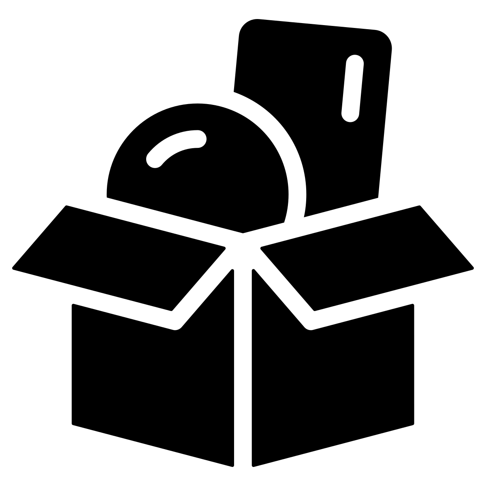
  </picture>
</p>

# wigglystuff 

> "A collection of creative AnyWidgets for Python notebook environments."

The project uses [anywidget](https://anywidget.dev/) under the hood so our tools should work in [marimo](https://marimo.io/), [Jupyter](https://jupyter.org/), [Shiny for Python](https://shiny.posit.co/py/docs/jupyter-widgets.html), [VSCode](https://code.visualstudio.com/docs/datascience/jupyter-notebooks), [Colab](https://colab.google/), [Solara](https://solara.dev/), etc. Because of the anywidget integration you should also be able interact with [ipywidgets](https://ipywidgets.readthedocs.io/en/stable/) natively. 

## Install 

```
uv pip install wigglystuff
```

## Widget Gallery

<table>
<tr>
<td align="center"><b>Slider2D</b><br><a href="https://molab.marimo.io/github/koaning/wigglystuff/blob/main/demos/slider2d.py/wasm?utm_source=wigglystuff">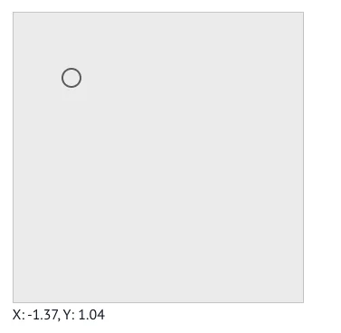</a><br><a href="https://molab.marimo.io/github/koaning/wigglystuff/blob/main/demos/slider2d.py/wasm?utm_source=wigglystuff">molab</a> · <a href="https://koaning.github.io/wigglystuff/reference/slider2d/">API</a> · <a href="https://koaning.github.io/wigglystuff/reference/slider2d.md">MD</a></td>
<td align="center"><b>BezierCurve</b><br><a href="https://molab.marimo.io/github/koaning/wigglystuff/blob/main/demos/beziercurve.py/wasm?utm_source=wigglystuff">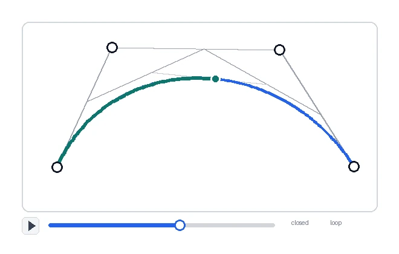</a><br><a href="https://molab.marimo.io/github/koaning/wigglystuff/blob/main/demos/beziercurve.py/wasm?utm_source=wigglystuff">molab</a> · <a href="https://koaning.github.io/wigglystuff/reference/bezier-curve/">API</a> · <a href="https://koaning.github.io/wigglystuff/reference/bezier-curve.md">MD</a></td>
<td align="center"><b>CurveEditor</b><br><a href="https://molab.marimo.io/github/koaning/wigglystuff/blob/main/demos/curveeditor.py/wasm?utm_source=wigglystuff">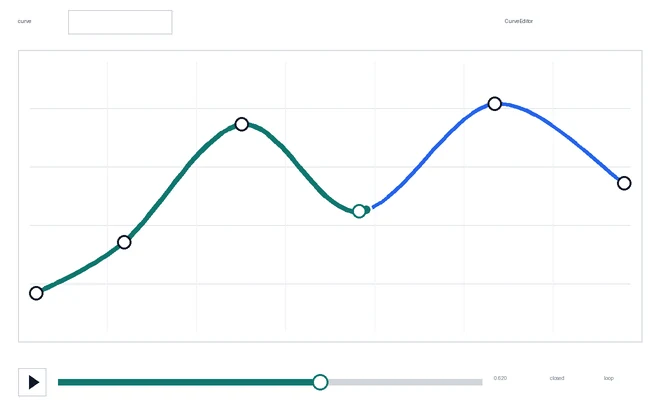</a><br><a href="https://molab.marimo.io/github/koaning/wigglystuff/blob/main/demos/curveeditor.py/wasm?utm_source=wigglystuff">molab</a> · <a href="https://koaning.github.io/wigglystuff/reference/curve-editor/">API</a> · <a href="https://koaning.github.io/wigglystuff/reference/curve-editor.md">MD</a></td>
</tr>
<tr>
<td align="center"><b>Matrix</b><br><a href="https://molab.marimo.io/github/koaning/wigglystuff/blob/main/demos/matrix.py/wasm?utm_source=wigglystuff">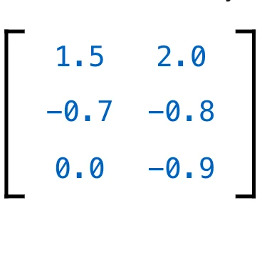</a><br><a href="https://molab.marimo.io/github/koaning/wigglystuff/blob/main/demos/matrix.py/wasm?utm_source=wigglystuff">molab</a> · <a href="https://koaning.github.io/wigglystuff/reference/matrix/">API</a> · <a href="https://koaning.github.io/wigglystuff/reference/matrix.md">MD</a></td>
<td align="center"><b>Paint</b><br><a href="https://molab.marimo.io/github/koaning/wigglystuff/blob/main/demos/paint.py/wasm?utm_source=wigglystuff">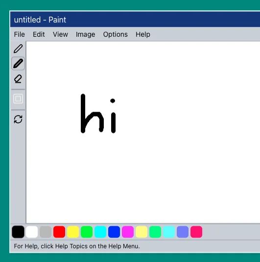</a><br><a href="https://molab.marimo.io/github/koaning/wigglystuff/blob/main/demos/paint.py/wasm?utm_source=wigglystuff">molab</a> · <a href="https://koaning.github.io/wigglystuff/reference/paint/">API</a> · <a href="https://koaning.github.io/wigglystuff/reference/paint.md">MD</a></td>
<td align="center"><b>EdgeDraw</b><br><a href="https://molab.marimo.io/github/koaning/wigglystuff/blob/main/demos/edgedraw.py/wasm?utm_source=wigglystuff">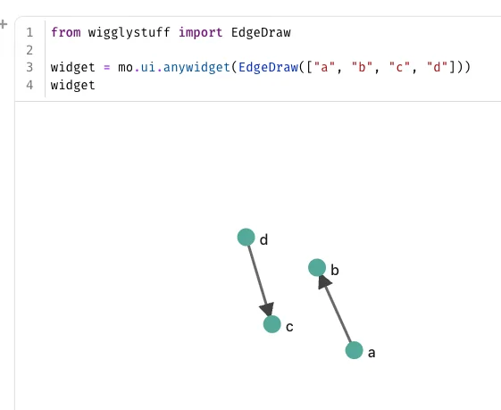</a><br><a href="https://molab.marimo.io/github/koaning/wigglystuff/blob/main/demos/edgedraw.py/wasm?utm_source=wigglystuff">molab</a> · <a href="https://koaning.github.io/wigglystuff/reference/edge-draw/">API</a> · <a href="https://koaning.github.io/wigglystuff/reference/edge-draw.md">MD</a></td>
</tr>
<tr>
<td align="center"><b>GraphWidget</b><br><a href="https://molab.marimo.io/github/koaning/wigglystuff/blob/main/demos/graphwidget.py/wasm?utm_source=wigglystuff">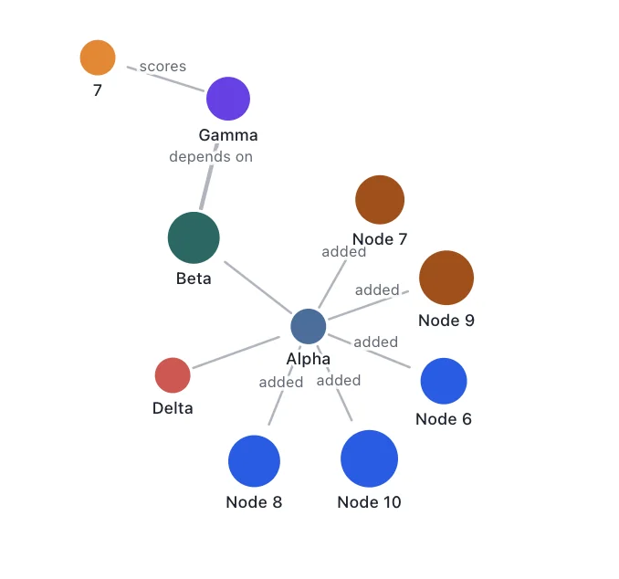</a><br><a href="https://molab.marimo.io/github/koaning/wigglystuff/blob/main/demos/graphwidget.py/wasm?utm_source=wigglystuff">molab</a> · <a href="https://koaning.github.io/wigglystuff/reference/graph-widget/">API</a> · <a href="https://koaning.github.io/wigglystuff/reference/graph-widget.md">MD</a></td>
<td align="center"><b>SortableList</b><br><a href="https://molab.marimo.io/github/koaning/wigglystuff/blob/main/demos/sortlist.py/wasm?utm_source=wigglystuff">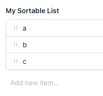</a><br><a href="https://molab.marimo.io/github/koaning/wigglystuff/blob/main/demos/sortlist.py/wasm?utm_source=wigglystuff">molab</a> · <a href="https://koaning.github.io/wigglystuff/reference/sortable-list/">API</a> · <a href="https://koaning.github.io/wigglystuff/reference/sortable-list.md">MD</a></td>
<td align="center"><b>ColorPicker</b><br><a href="https://molab.marimo.io/github/koaning/wigglystuff/blob/main/demos/colorpicker.py/wasm?utm_source=wigglystuff">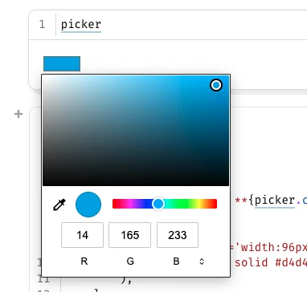</a><br><a href="https://molab.marimo.io/github/koaning/wigglystuff/blob/main/demos/colorpicker.py/wasm?utm_source=wigglystuff">molab</a> · <a href="https://koaning.github.io/wigglystuff/reference/color-picker/">API</a> · <a href="https://koaning.github.io/wigglystuff/reference/color-picker.md">MD</a></td>
</tr>
<tr>
<td align="center"><b>HoverZoom</b><br><a href="https://molab.marimo.io/github/koaning/wigglystuff/blob/main/demos/hoverzoom.py/wasm?utm_source=wigglystuff">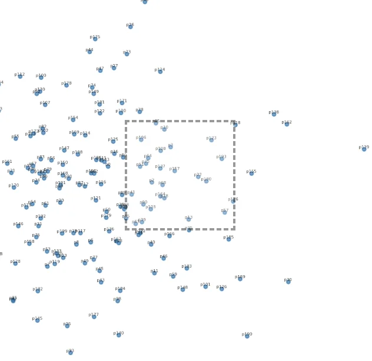</a><br><a href="https://molab.marimo.io/github/koaning/wigglystuff/blob/main/demos/hoverzoom.py/wasm?utm_source=wigglystuff">molab</a> · <a href="https://koaning.github.io/wigglystuff/reference/hover-zoom/">API</a> · <a href="https://koaning.github.io/wigglystuff/reference/hover-zoom.md">MD</a></td>
<td align="center"><b>GamepadWidget</b><br><a href="https://molab.marimo.io/github/koaning/wigglystuff/blob/main/demos/gamepad.py/wasm?utm_source=wigglystuff">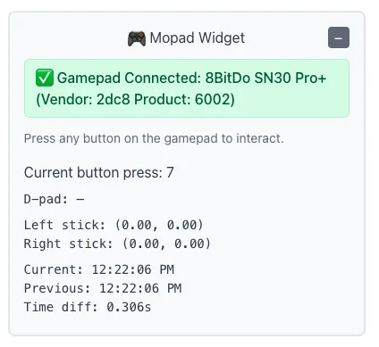</a><br><a href="https://molab.marimo.io/github/koaning/wigglystuff/blob/main/demos/gamepad.py/wasm?utm_source=wigglystuff">molab</a> · <a href="https://koaning.github.io/wigglystuff/reference/gamepad/">API</a> · <a href="https://koaning.github.io/wigglystuff/reference/gamepad.md">MD</a></td>
<td align="center"><b>GridDraw</b><br><a href="https://molab.marimo.io/github/koaning/wigglystuff/blob/main/demos/griddraw.py/wasm?utm_source=wigglystuff">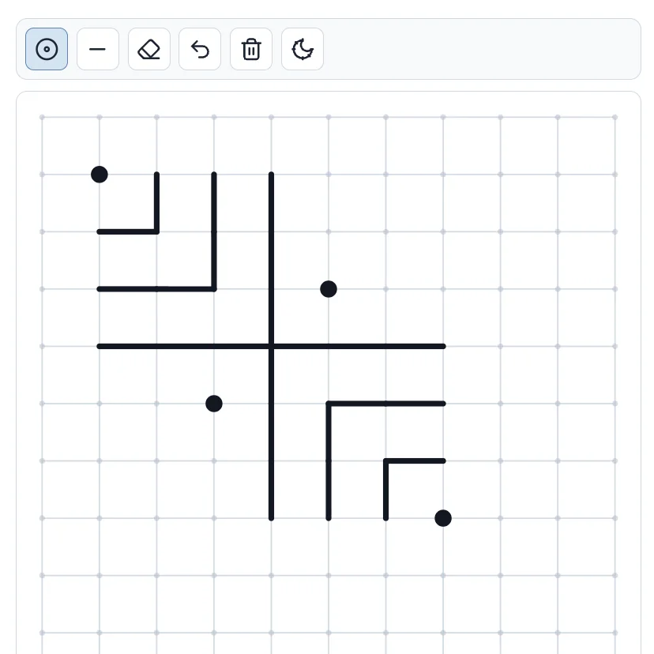</a><br><a href="https://molab.marimo.io/github/koaning/wigglystuff/blob/main/demos/griddraw.py/wasm?utm_source=wigglystuff">molab</a> · <a href="https://koaning.github.io/wigglystuff/reference/grid-draw/">API</a> · <a href="https://koaning.github.io/wigglystuff/reference/grid-draw.md">MD</a></td>
</tr>
<tr>
<td align="center"><b>KeystrokeWidget</b><br><a href="https://molab.marimo.io/github/koaning/wigglystuff/blob/main/demos/keystroke.py/wasm?utm_source=wigglystuff">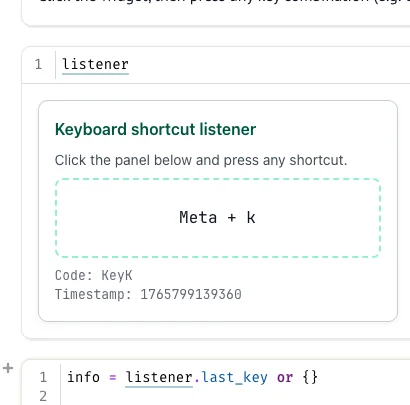</a><br><a href="https://molab.marimo.io/github/koaning/wigglystuff/blob/main/demos/keystroke.py/wasm?utm_source=wigglystuff">molab</a> · <a href="https://koaning.github.io/wigglystuff/reference/keystroke/">API</a> · <a href="https://koaning.github.io/wigglystuff/reference/keystroke.md">MD</a></td>
<td align="center"><b>SpeechToText</b><br><a href="https://molab.marimo.io/github/koaning/wigglystuff/blob/main/demos/talk.py/wasm?utm_source=wigglystuff">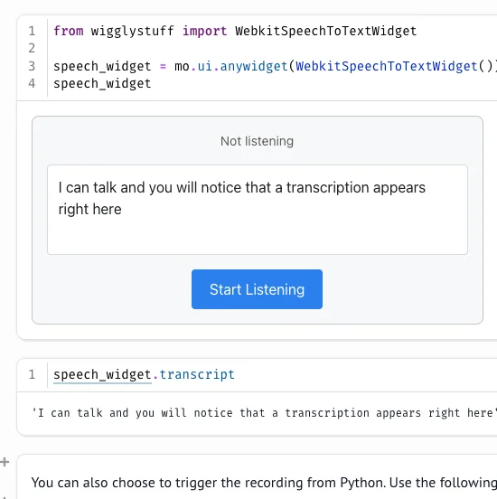</a><br><a href="https://molab.marimo.io/github/koaning/wigglystuff/blob/main/demos/talk.py/wasm?utm_source=wigglystuff">molab</a> · <a href="https://koaning.github.io/wigglystuff/reference/talk/">API</a> · <a href="https://koaning.github.io/wigglystuff/reference/talk.md">MD</a></td>
<td align="center"><b>CopyToClipboard</b><br><a href="https://molab.marimo.io/github/koaning/wigglystuff/blob/main/demos/copytoclipboard.py/wasm?utm_source=wigglystuff">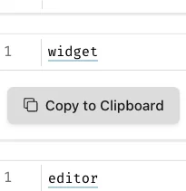</a><br><a href="https://molab.marimo.io/github/koaning/wigglystuff/blob/main/demos/copytoclipboard.py/wasm?utm_source=wigglystuff">molab</a> · <a href="https://koaning.github.io/wigglystuff/reference/copy-to-clipboard/">API</a> · <a href="https://koaning.github.io/wigglystuff/reference/copy-to-clipboard.md">MD</a></td>
</tr>
<tr>
<td align="center"><b>CellTour</b><br><a href="https://molab.marimo.io/github/koaning/wigglystuff/blob/main/demos/celltour.py/wasm?utm_source=wigglystuff">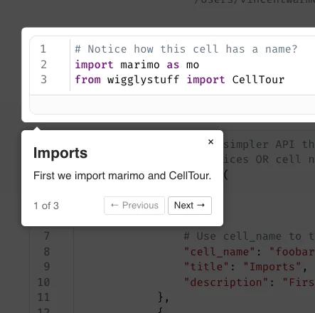</a><br><a href="https://molab.marimo.io/github/koaning/wigglystuff/blob/main/demos/celltour.py/wasm?utm_source=wigglystuff">molab</a> · <a href="https://koaning.github.io/wigglystuff/reference/cell-tour/">API</a> · <a href="https://koaning.github.io/wigglystuff/reference/cell-tour.md">MD</a></td>
<td align="center"><b>WebcamCapture</b><br><a href="https://molab.marimo.io/github/koaning/wigglystuff/blob/main/demos/webcam_capture.py/wasm?utm_source=wigglystuff">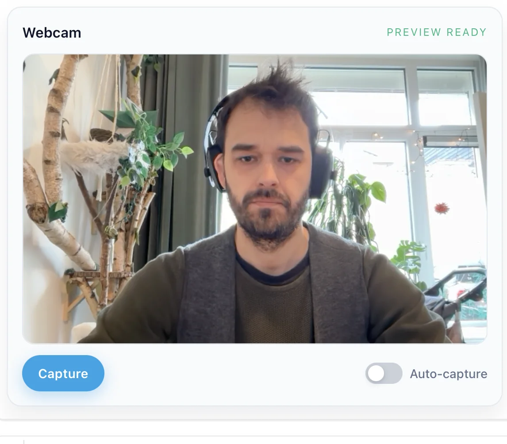</a><br><a href="https://molab.marimo.io/github/koaning/wigglystuff/blob/main/demos/webcam_capture.py/wasm?utm_source=wigglystuff">molab</a> · <a href="https://koaning.github.io/wigglystuff/reference/webcam-capture/">API</a> · <a href="https://koaning.github.io/wigglystuff/reference/webcam-capture.md">MD</a></td>
<td align="center"><b>ThreeWidget</b><br><a href="https://molab.marimo.io/github/koaning/wigglystuff/blob/main/demos/threewidget.py/wasm?utm_source=wigglystuff">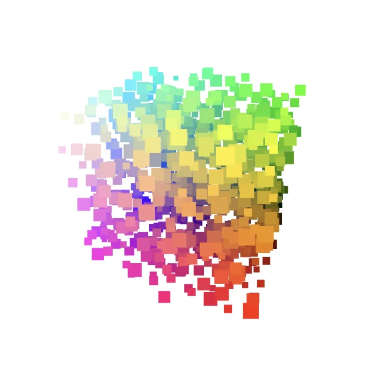</a><br><a href="https://molab.marimo.io/github/koaning/wigglystuff/blob/main/demos/threewidget.py/wasm?utm_source=wigglystuff">molab</a> · <a href="https://koaning.github.io/wigglystuff/reference/three-widget/">API</a> · <a href="https://koaning.github.io/wigglystuff/reference/three-widget.md">MD</a></td>
</tr>
<tr>
<td align="center"><b>ImageRefreshWidget</b><br><a href="https://molab.marimo.io/github/koaning/wigglystuff/blob/main/demos/htmlwidget.py/wasm?utm_source=wigglystuff">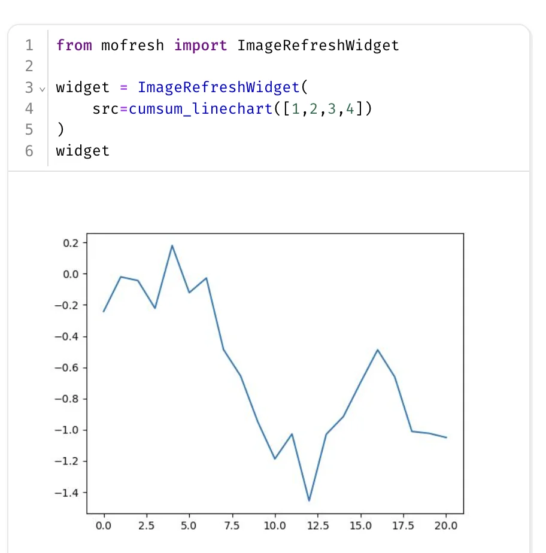</a><br><a href="https://molab.marimo.io/github/koaning/wigglystuff/blob/main/demos/htmlwidget.py/wasm?utm_source=wigglystuff">molab</a> · <a href="https://koaning.github.io/wigglystuff/reference/image-refresh/">API</a> · <a href="https://koaning.github.io/wigglystuff/reference/image-refresh.md">MD</a></td>
<td align="center"><b>HTMLRefreshWidget</b><br><a href="https://molab.marimo.io/github/koaning/wigglystuff/blob/main/demos/htmlwidget.py/wasm?utm_source=wigglystuff">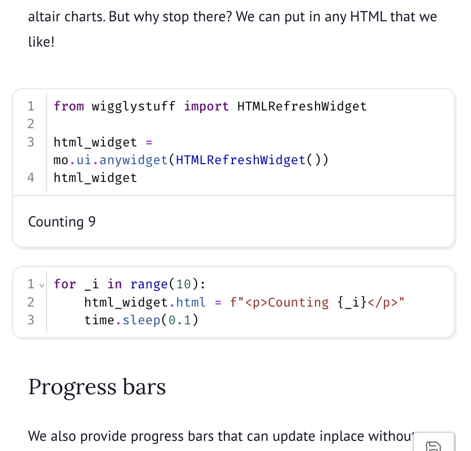</a><br><a href="https://molab.marimo.io/github/koaning/wigglystuff/blob/main/demos/htmlwidget.py/wasm?utm_source=wigglystuff">molab</a> · <a href="https://koaning.github.io/wigglystuff/reference/html-refresh/">API</a> · <a href="https://koaning.github.io/wigglystuff/reference/html-refresh.md">MD</a></td>
<td align="center"><b>ProgressBar</b><br><a href="https://molab.marimo.io/github/koaning/wigglystuff/blob/main/demos/progressbar.py/wasm?utm_source=wigglystuff">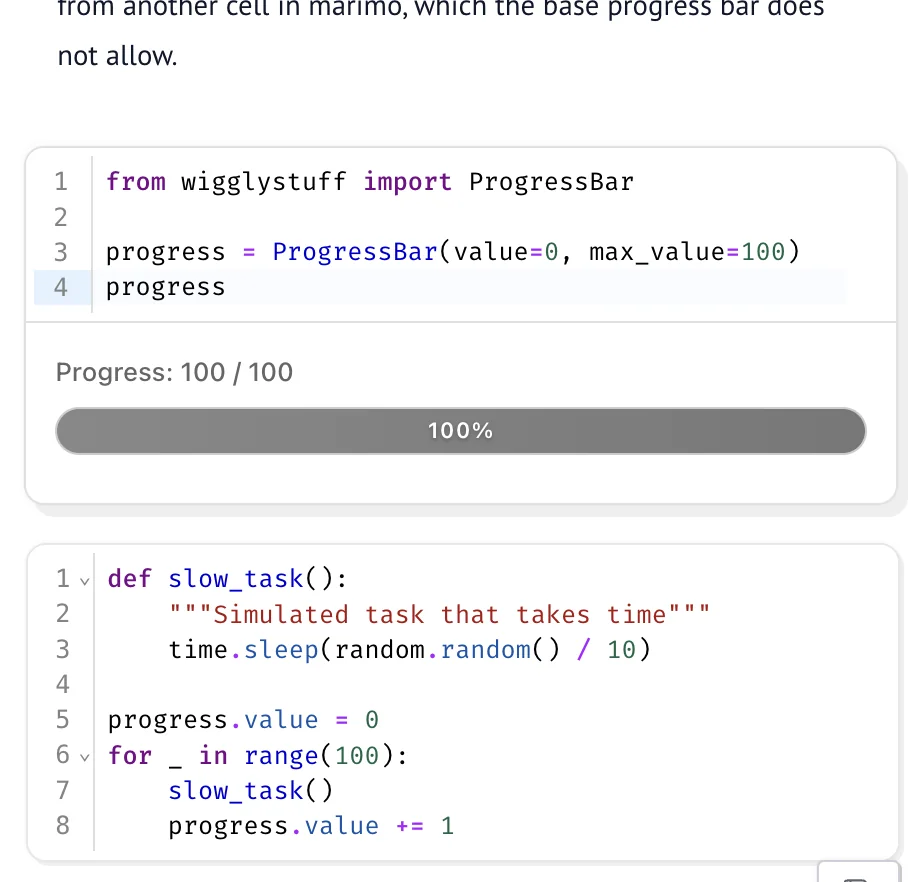</a><br><a href="https://molab.marimo.io/github/koaning/wigglystuff/blob/main/demos/progressbar.py/wasm?utm_source=wigglystuff">molab</a> · <a href="https://koaning.github.io/wigglystuff/reference/progress-bar/">API</a> · <a href="https://koaning.github.io/wigglystuff/reference/progress-bar.md">MD</a></td>
</tr>
<tr>
<td align="center"><b>RidgelineChart</b><br><a href="https://molab.marimo.io/github/koaning/wigglystuff/blob/main/demos/ridgelinechart.py/wasm?utm_source=wigglystuff">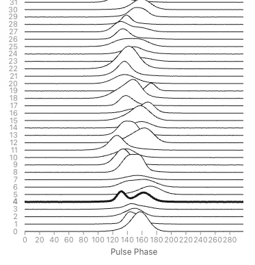</a><br><a href="https://molab.marimo.io/github/koaning/wigglystuff/blob/main/demos/ridgelinechart.py/wasm?utm_source=wigglystuff">molab</a> · <a href="https://koaning.github.io/wigglystuff/reference/ridgeline-chart/">API</a> · <a href="https://koaning.github.io/wigglystuff/reference/ridgeline-chart.md">MD</a></td>
<td align="center"><b>TextCompare</b><br><a href="https://molab.marimo.io/github/koaning/wigglystuff/blob/main/demos/textcompare.py/wasm?utm_source=wigglystuff">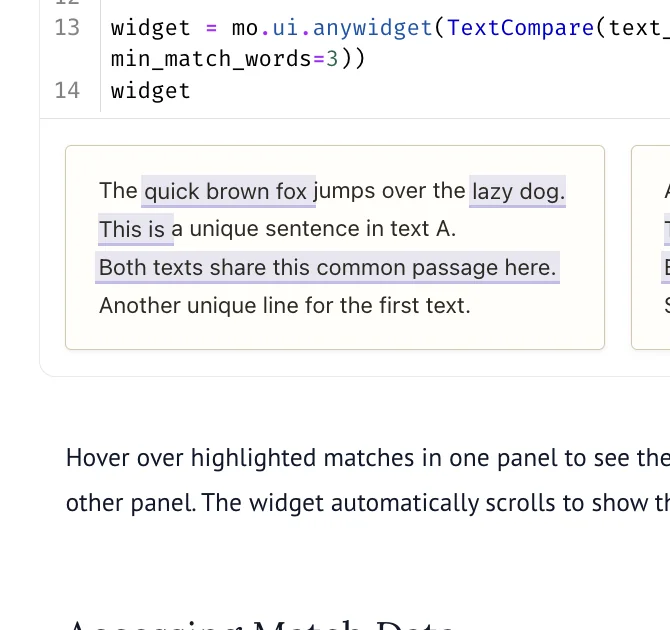</a><br><a href="https://molab.marimo.io/github/koaning/wigglystuff/blob/main/demos/textcompare.py/wasm?utm_source=wigglystuff">molab</a> · <a href="https://koaning.github.io/wigglystuff/reference/text-compare/">API</a> · <a href="https://koaning.github.io/wigglystuff/reference/text-compare.md">MD</a></td>
<td align="center"><b>EnvConfig</b><br><a href="https://molab.marimo.io/github/koaning/wigglystuff/blob/main/demos/envconfig.py/wasm?utm_source=wigglystuff">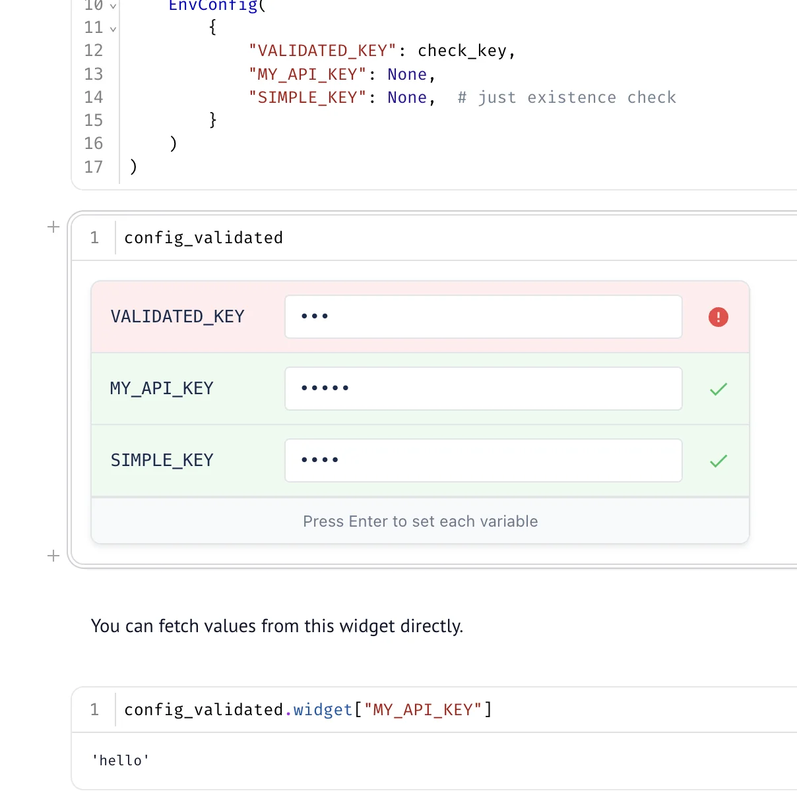</a><br><a href="https://molab.marimo.io/github/koaning/wigglystuff/blob/main/demos/envconfig.py/wasm?utm_source=wigglystuff">molab</a> · <a href="https://koaning.github.io/wigglystuff/reference/env-config/">API</a> · <a href="https://koaning.github.io/wigglystuff/reference/env-config.md">MD</a></td>
</tr>
<tr>
<td align="center"><b>Tangle</b><br><a href="https://molab.marimo.io/github/koaning/wigglystuff/blob/main/demos/tangle.py/wasm?utm_source=wigglystuff">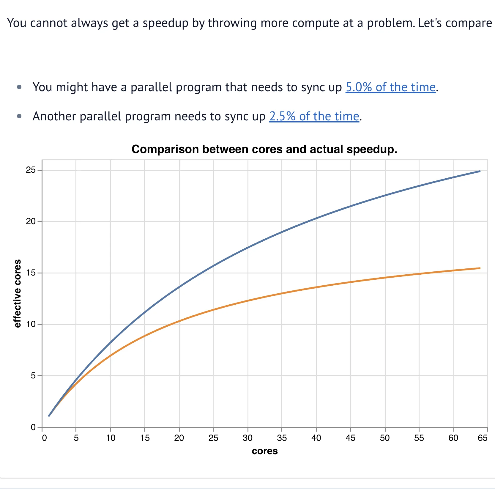</a><br><a href="https://molab.marimo.io/github/koaning/wigglystuff/blob/main/demos/tangle.py/wasm?utm_source=wigglystuff">molab</a> · <a href="https://koaning.github.io/wigglystuff/reference/tangle/">API</a> · <a href="https://koaning.github.io/wigglystuff/reference/tangle.md">MD</a></td>
<td align="center"><b>ChartPuck</b><br><a href="https://molab.marimo.io/github/koaning/wigglystuff/blob/main/demos/chartpuck.py/wasm?utm_source=wigglystuff">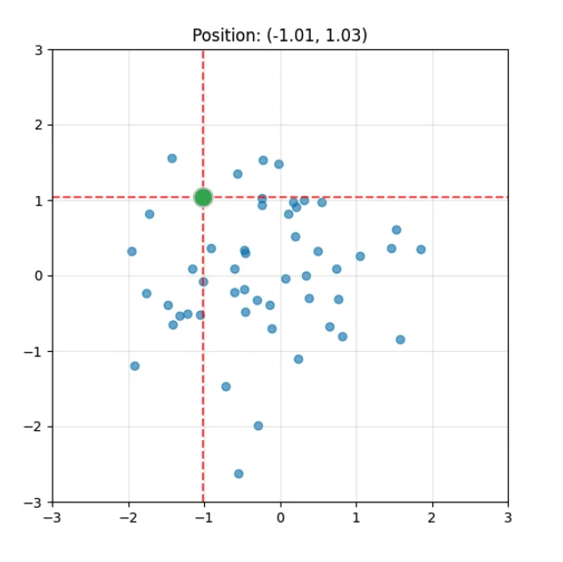</a><br><a href="https://molab.marimo.io/github/koaning/wigglystuff/blob/main/demos/chartpuck.py/wasm?utm_source=wigglystuff">molab</a> · <a href="https://koaning.github.io/wigglystuff/reference/chart-puck/">API</a> · <a href="https://koaning.github.io/wigglystuff/reference/chart-puck.md">MD</a></td>
<td align="center"><b>ChartMultiSelect</b><br><a href="https://molab.marimo.io/github/koaning/wigglystuff/blob/main/demos/chartmultiselect.py/wasm?utm_source=wigglystuff">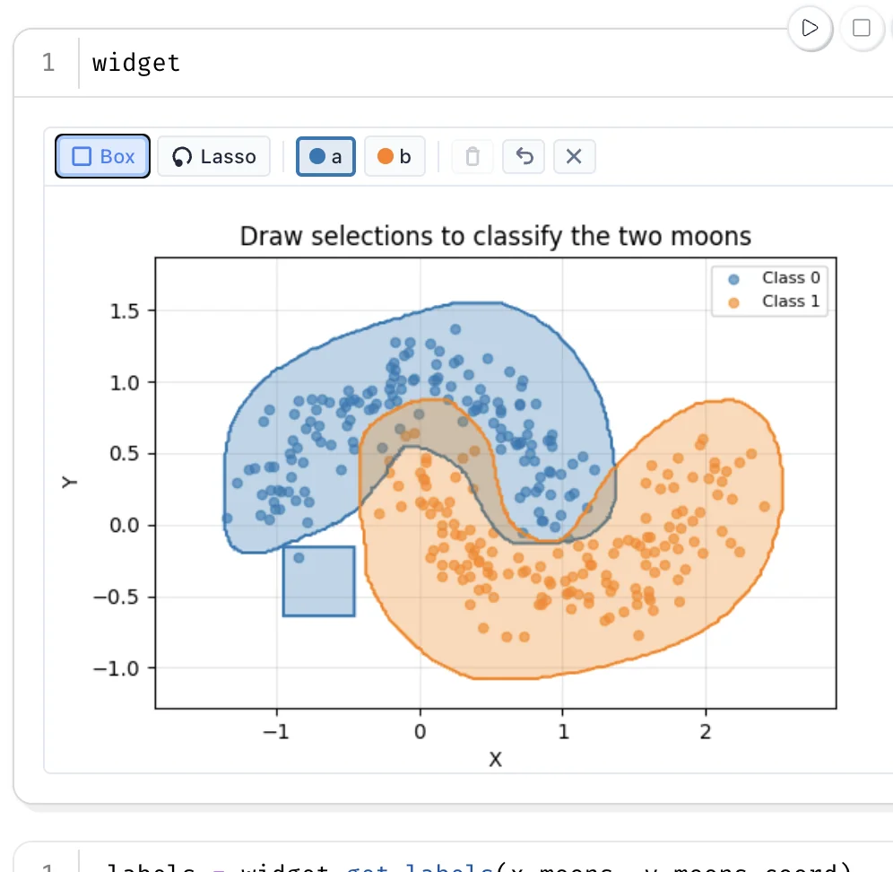</a><br><a href="https://molab.marimo.io/github/koaning/wigglystuff/blob/main/demos/chartmultiselect.py/wasm?utm_source=wigglystuff">molab</a> · <a href="https://koaning.github.io/wigglystuff/reference/chart-multi-select/">API</a> · <a href="https://koaning.github.io/wigglystuff/reference/chart-multi-select.md">MD</a></td>
</tr>
<tr>
<td align="center"><b>ChartSelect</b><br><a href="https://molab.marimo.io/github/koaning/wigglystuff/blob/main/demos/chartselect.py/wasm?utm_source=wigglystuff">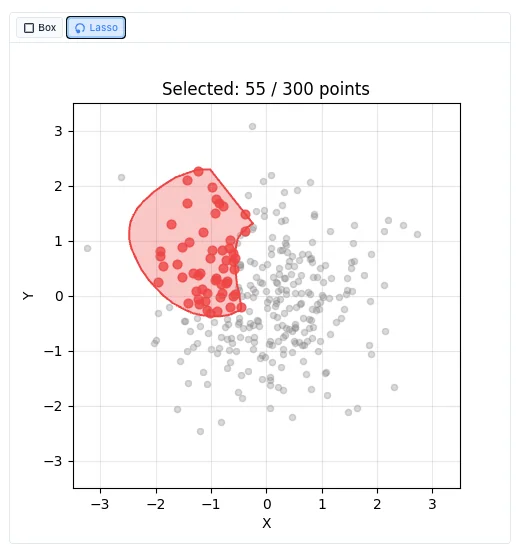</a><br><a href="https://molab.marimo.io/github/koaning/wigglystuff/blob/main/demos/chartselect.py/wasm?utm_source=wigglystuff">molab</a> · <a href="https://koaning.github.io/wigglystuff/reference/chart-select/">API</a> · <a href="https://koaning.github.io/wigglystuff/reference/chart-select.md">MD</a></td>
<td align="center"><b>ScatterWidget</b><br><a href="https://molab.marimo.io/github/koaning/wigglystuff/blob/main/demos/scatterwidget.py/wasm?utm_source=wigglystuff">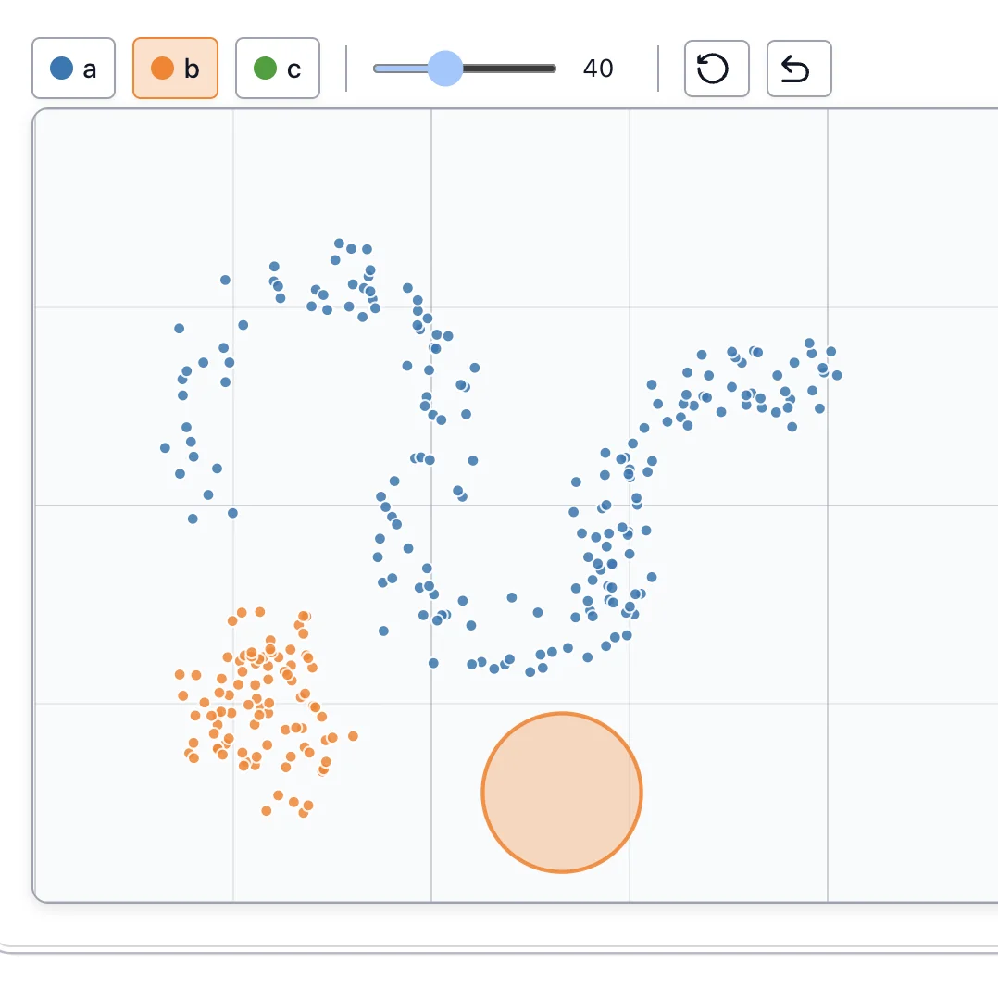</a><br><a href="https://molab.marimo.io/github/koaning/wigglystuff/blob/main/demos/scatterwidget.py/wasm?utm_source=wigglystuff">molab</a> · <a href="https://koaning.github.io/wigglystuff/reference/scatter-widget/">API</a> · <a href="https://koaning.github.io/wigglystuff/reference/scatter-widget.md">MD</a></td>
<td align="center"><b>SplineDraw</b><br><a href="https://molab.marimo.io/github/koaning/wigglystuff/blob/main/demos/splinedraw.py/wasm?utm_source=wigglystuff">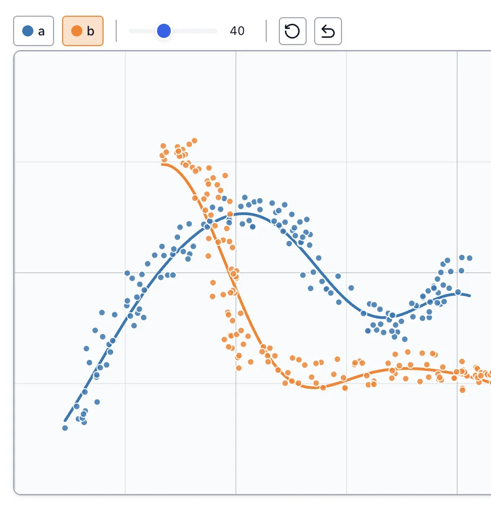</a><br><a href="https://molab.marimo.io/github/koaning/wigglystuff/blob/main/demos/splinedraw.py/wasm?utm_source=wigglystuff">molab</a> · <a href="https://koaning.github.io/wigglystuff/reference/spline-draw/">API</a> · <a href="https://koaning.github.io/wigglystuff/reference/spline-draw.md">MD</a></td>
</tr>
<tr>
<td align="center"><b>ApiDoc</b><br><a href="https://molab.marimo.io/github/koaning/wigglystuff/blob/main/demos/apidoc.py/wasm?utm_source=wigglystuff">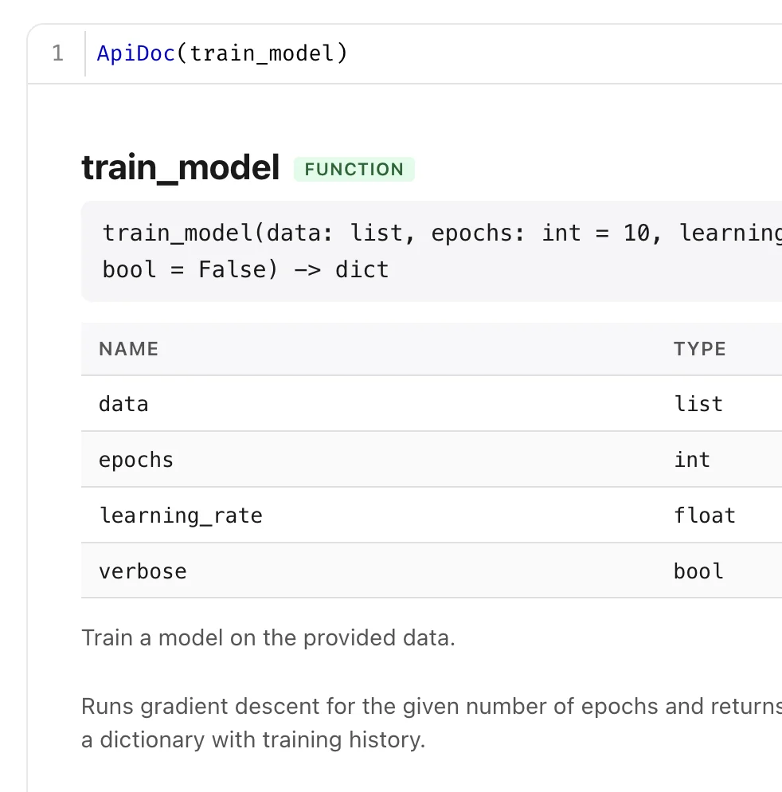</a><br><a href="https://molab.marimo.io/github/koaning/wigglystuff/blob/main/demos/apidoc.py/wasm?utm_source=wigglystuff">molab</a> · <a href="https://koaning.github.io/wigglystuff/reference/api-doc/">API</a> · <a href="https://koaning.github.io/wigglystuff/reference/api-doc.md">MD</a></td>
<td align="center"><b>ParallelCoordinates</b><br><a href="https://molab.marimo.io/github/koaning/wigglystuff/blob/main/demos/parallelcoords.py/wasm?utm_source=wigglystuff">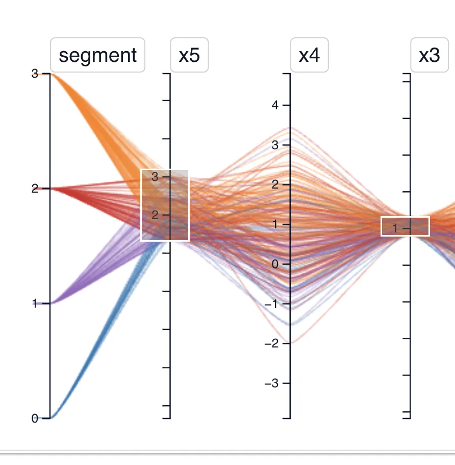</a><br><a href="https://molab.marimo.io/github/koaning/wigglystuff/blob/main/demos/parallelcoords.py/wasm?utm_source=wigglystuff">molab</a> · <a href="https://koaning.github.io/wigglystuff/reference/parallel-coords/">API</a> · <a href="https://koaning.github.io/wigglystuff/reference/parallel-coords.md">MD</a></td>
<td align="center"><b>AnnotationWidget</b><br><a href="https://molab.marimo.io/github/koaning/wigglystuff/blob/main/demos/annotation.py/wasm?utm_source=wigglystuff">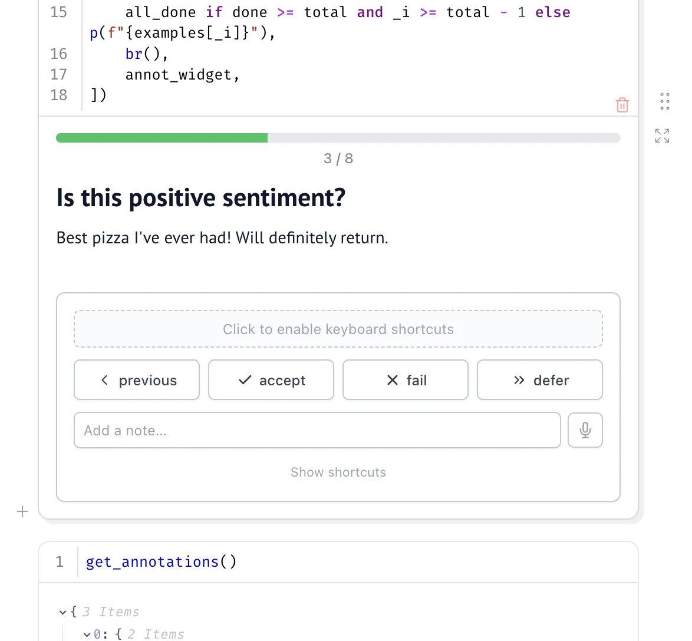</a><br><a href="https://molab.marimo.io/github/koaning/wigglystuff/blob/main/demos/annotation.py/wasm?utm_source=wigglystuff">molab</a> · <a href="https://koaning.github.io/wigglystuff/reference/annotation/">API</a> · <a href="https://koaning.github.io/wigglystuff/reference/annotation.md">MD</a></td>
</tr>
<tr>
<td align="center"><b>PlaySlider</b><br><a href="https://molab.marimo.io/github/koaning/wigglystuff/blob/main/demos/play_slider.py/wasm?utm_source=wigglystuff">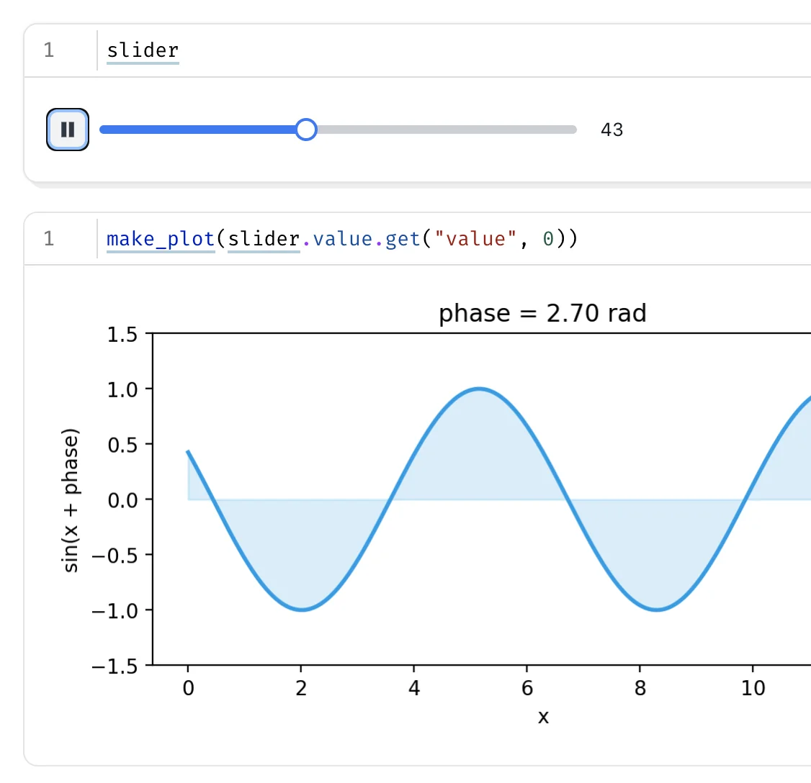</a><br><a href="https://molab.marimo.io/github/koaning/wigglystuff/blob/main/demos/play_slider.py/wasm?utm_source=wigglystuff">molab</a> · <a href="https://koaning.github.io/wigglystuff/reference/play-slider/">API</a> · <a href="https://koaning.github.io/wigglystuff/reference/play-slider.md">MD</a></td>
<td align="center"><b>forecast_chart</b><br><a href="https://molab.marimo.io/github/koaning/wigglystuff/blob/main/demos/forecast_chart.py?utm_source=wigglystuff">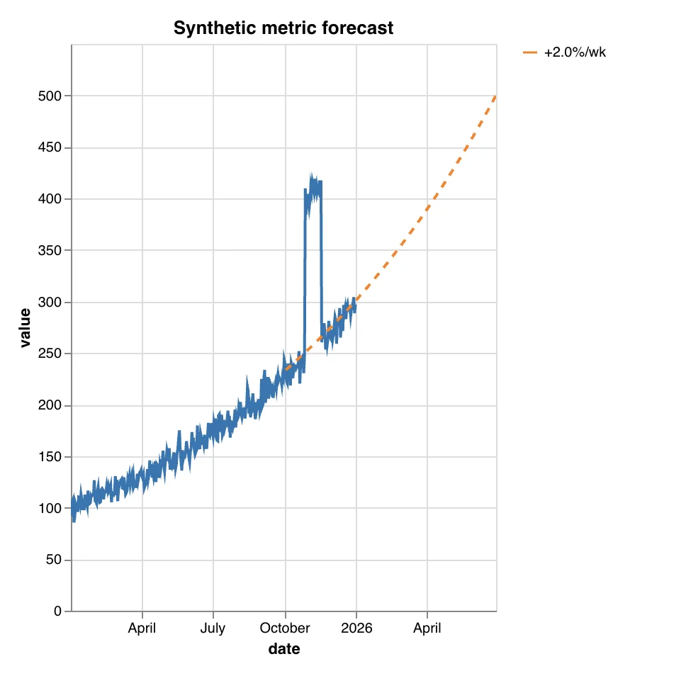</a><br><a href="https://molab.marimo.io/github/koaning/wigglystuff/blob/main/demos/forecast_chart.py?utm_source=wigglystuff">molab</a> · <a href="https://koaning.github.io/wigglystuff/reference/utils/">API</a> · <a href="https://koaning.github.io/wigglystuff/reference/utils.md">MD</a></td>
<td align="center"><b>Treemap</b><br><a href="https://molab.marimo.io/github/koaning/wigglystuff/blob/main/demos/treemap.py/wasm?utm_source=wigglystuff">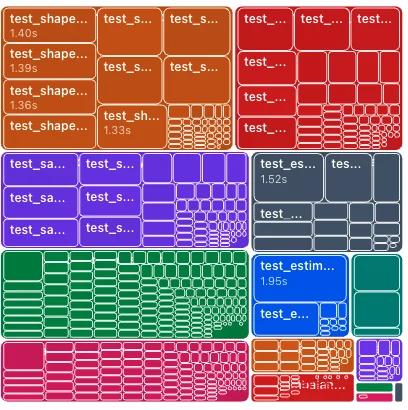</a><br><a href="https://molab.marimo.io/github/koaning/wigglystuff/blob/main/demos/treemap.py/wasm?utm_source=wigglystuff">molab</a> · <a href="https://koaning.github.io/wigglystuff/reference/treemap/">API</a> · <a href="https://koaning.github.io/wigglystuff/reference/treemap.md">MD</a></td>
</tr>
<tr>
<td align="center"><b>NestedTable</b><br><a href="https://molab.marimo.io/github/koaning/wigglystuff/blob/main/demos/nested_table.py/wasm?utm_source=wigglystuff">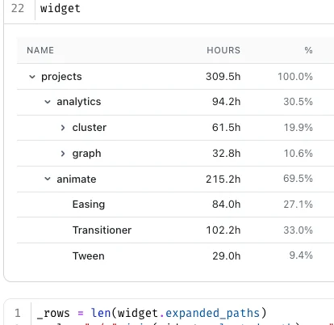</a><br><a href="https://molab.marimo.io/github/koaning/wigglystuff/blob/main/demos/nested_table.py/wasm?utm_source=wigglystuff">molab</a> · <a href="https://koaning.github.io/wigglystuff/reference/nested-table/">API</a> · <a href="https://koaning.github.io/wigglystuff/reference/nested-table.md">MD</a></td>
<td align="center"><b>CircularSlider</b><br><a href="https://molab.marimo.io/github/koaning/wigglystuff/blob/main/demos/circular_slider.py/wasm?utm_source=wigglystuff">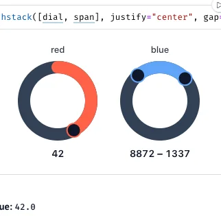</a><br><a href="https://molab.marimo.io/github/koaning/wigglystuff/blob/main/demos/circular_slider.py/wasm?utm_source=wigglystuff">molab</a> · <a href="https://koaning.github.io/wigglystuff/reference/circular-slider/">API</a> · <a href="https://koaning.github.io/wigglystuff/reference/circular-slider.md">MD</a></td>
<td align="center"><b>Excalidraw</b><br><a href="https://molab.marimo.io/github/koaning/wigglystuff/blob/main/demos/excalidraw.py/wasm?utm_source=wigglystuff">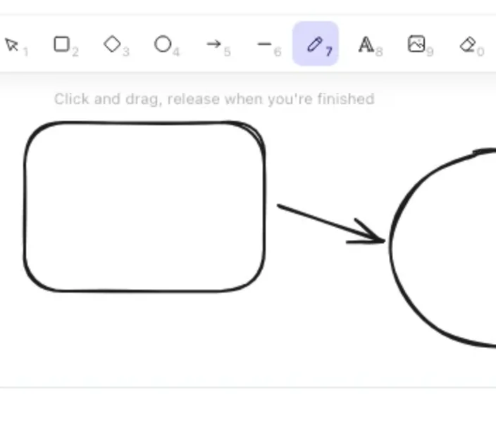</a><br><a href="https://molab.marimo.io/github/koaning/wigglystuff/blob/main/demos/excalidraw.py/wasm?utm_source=wigglystuff">molab</a> · <a href="https://koaning.github.io/wigglystuff/reference/excalidraw/">API</a> · <a href="https://koaning.github.io/wigglystuff/reference/excalidraw.md">MD</a></td>
</tr>
<tr>
<td align="center"><b>LiveEdit</b><br><a href="https://molab.marimo.io/github/koaning/wigglystuff/blob/main/demos/liveedit.py/wasm?utm_source=wigglystuff">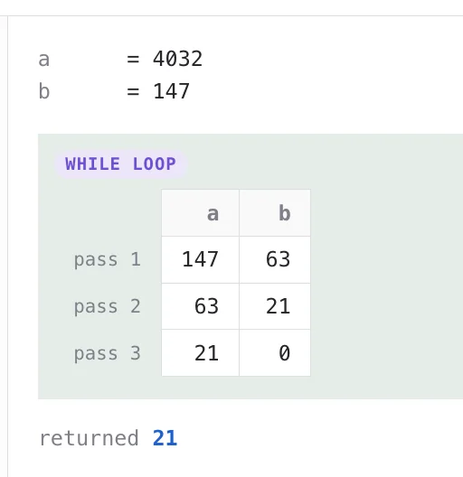</a><br><a href="https://molab.marimo.io/github/koaning/wigglystuff/blob/main/demos/liveedit.py/wasm?utm_source=wigglystuff">molab</a> · <a href="https://koaning.github.io/wigglystuff/reference/live-edit/">API</a> · <a href="https://koaning.github.io/wigglystuff/reference/live-edit.md">MD</a></td>
<td align="center"><b>FramePlayer</b><br><a href="https://molab.marimo.io/github/koaning/wigglystuff/blob/main/demos/frame_player.py/wasm?utm_source=wigglystuff">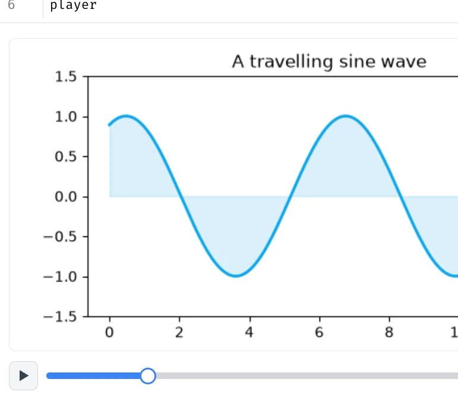</a><br><a href="https://molab.marimo.io/github/koaning/wigglystuff/blob/main/demos/frame_player.py/wasm?utm_source=wigglystuff">molab</a> · <a href="https://koaning.github.io/wigglystuff/reference/frame-player/">API</a> · <a href="https://koaning.github.io/wigglystuff/reference/frame-player.md">MD</a></td>
<td align="center"><b>AsyncFlow</b><br><a href="https://molab.marimo.io/github/koaning/wigglystuff/blob/main/demos/asyncflow.py/wasm?utm_source=wigglystuff">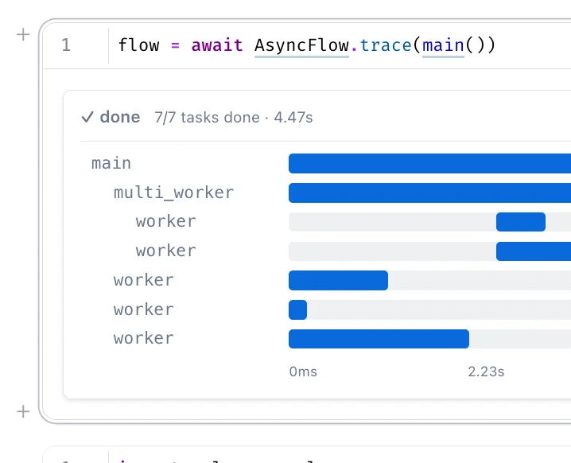</a><br><a href="https://molab.marimo.io/github/koaning/wigglystuff/blob/main/demos/asyncflow.py/wasm?utm_source=wigglystuff">molab</a> · <a href="https://koaning.github.io/wigglystuff/reference/async-flow/">API</a> · <a href="https://koaning.github.io/wigglystuff/reference/async-flow.md">MD</a></td>
</tr>
<tr>
<td align="center"><b>ManimWeb</b><br><a href="https://molab.marimo.io/github/koaning/wigglystuff/blob/main/demos/manim_web.py/wasm?utm_source=wigglystuff">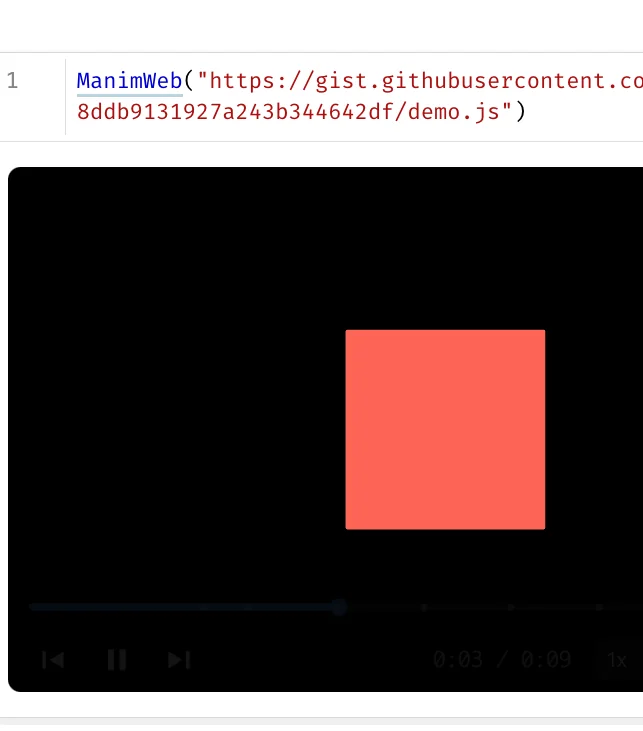</a><br><a href="https://molab.marimo.io/github/koaning/wigglystuff/blob/main/demos/manim_web.py/wasm?utm_source=wigglystuff">molab</a> · <a href="https://koaning.github.io/wigglystuff/reference/manim-web/">API</a> · <a href="https://koaning.github.io/wigglystuff/reference/manim-web.md">MD</a></td>
<td align="center"><b>ObservablePlot</b><br><a href="https://molab.marimo.io/github/koaning/wigglystuff/blob/main/demos/observableplot.py/wasm?utm_source=wigglystuff">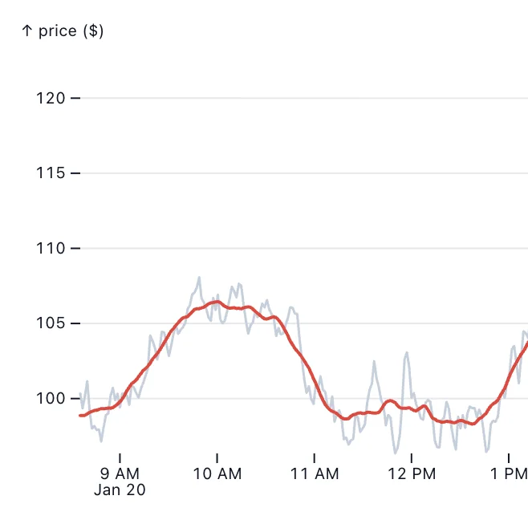</a><br><a href="https://molab.marimo.io/github/koaning/wigglystuff/blob/main/demos/observableplot.py/wasm?utm_source=wigglystuff">molab</a> · <a href="https://koaning.github.io/wigglystuff/reference/observable-plot/">API</a> · <a href="https://koaning.github.io/wigglystuff/reference/observable-plot.md">MD</a></td>
<td align="center"><b>EsmWidget</b><br><a href="https://molab.marimo.io/github/koaning/wigglystuff/blob/main/demos/esm_widget.py/wasm?utm_source=wigglystuff">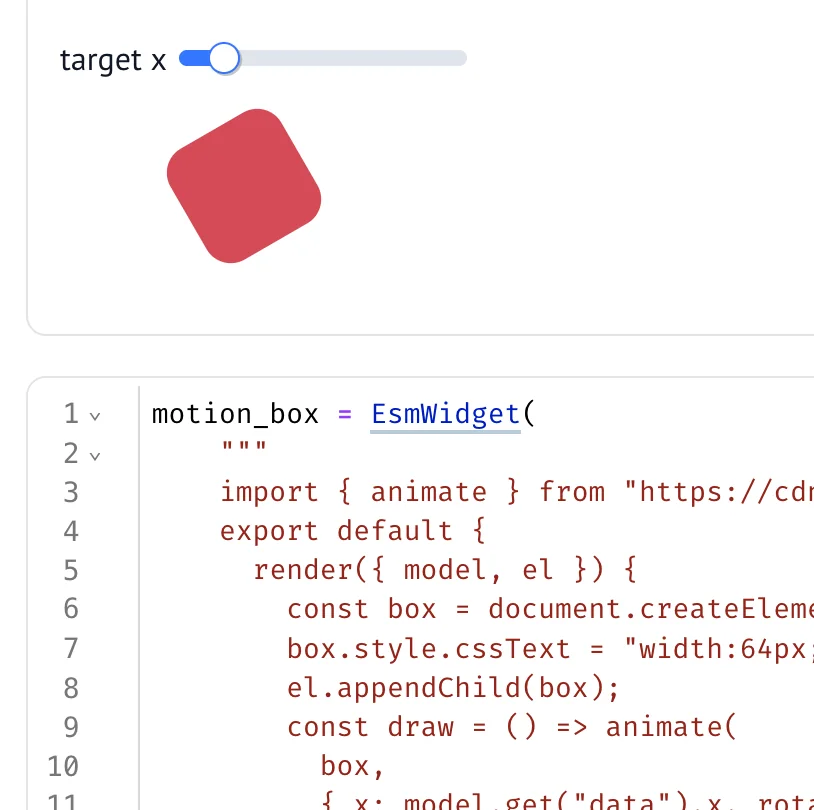</a><br><a href="https://molab.marimo.io/github/koaning/wigglystuff/blob/main/demos/esm_widget.py/wasm?utm_source=wigglystuff">molab</a> · <a href="https://koaning.github.io/wigglystuff/reference/esm-widget/">API</a> · <a href="https://koaning.github.io/wigglystuff/reference/esm-widget.md">MD</a></td>
</tr>
</table>

## 3rd party widgets

These widgets depend on 3rd party packages. They still ship with wigglystuff but have demos hosted on [molab](https://molab.marimo.io?utm_source=wigglystuff) because many of the dependencies are not compatible with WASM.

<table>
<tr>
<td align="center"><b>ModuleTreeWidget</b><br><a href="https://molab.marimo.io/notebooks/nb_K7QvvoASZErgKxwD8XSMWi?utm_source=wigglystuff">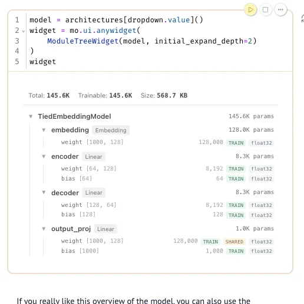</a><br><a href="https://molab.marimo.io/notebooks/nb_K7QvvoASZErgKxwD8XSMWi?utm_source=wigglystuff">molab</a> · <a href="https://koaning.github.io/wigglystuff/reference/module-tree/">API</a> · <a href="https://koaning.github.io/wigglystuff/reference/module-tree.md">MD</a></td>
<td align="center"><b>Neo4jWidget</b><br><a href="https://molab.marimo.io/notebooks/nb_ghifaw8nRCuDAgc1UTajXU?utm_source=wigglystuff">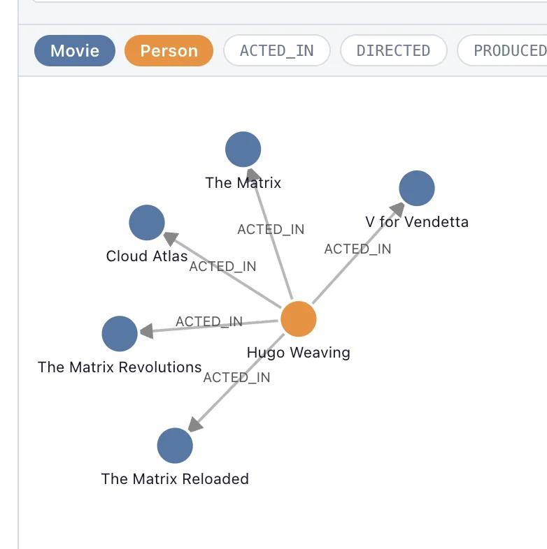</a><br><a href="https://molab.marimo.io/notebooks/nb_ghifaw8nRCuDAgc1UTajXU?utm_source=wigglystuff">molab</a> · <a href="https://koaning.github.io/wigglystuff/reference/neo4j-widget/">API</a> · <a href="https://koaning.github.io/wigglystuff/reference/neo4j-widget.md">MD</a></td>
<td align="center"><b>AltairWidget</b><br><a href="https://molab.marimo.io/github/koaning/wigglystuff/blob/main/demos/altairwidget.py?utm_source=wigglystuff">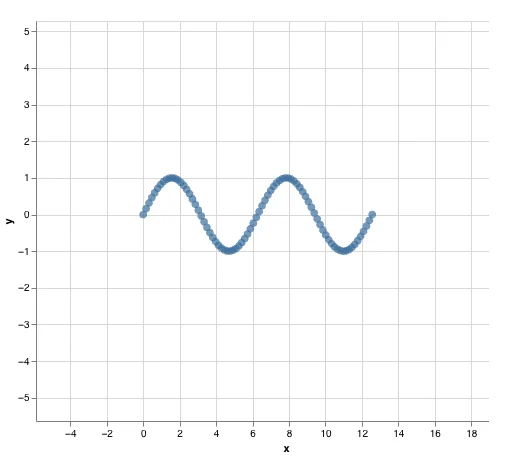</a><br><a href="https://molab.marimo.io/github/koaning/wigglystuff/blob/main/demos/altairwidget.py?utm_source=wigglystuff">molab</a> · <a href="https://koaning.github.io/wigglystuff/reference/altair-widget/">API</a> · <a href="https://koaning.github.io/wigglystuff/reference/altair-widget.md">MD</a></td>
</tr>
</table>
