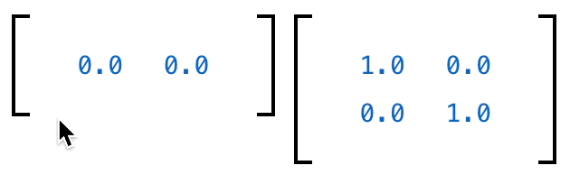

# wigglystuff 


> "A collection of creative AnyWidgets for Python notebook environments."

The project uses [anywidget](https://anywidget.dev/) under the hood so our tools should work in [Jupyter](https://jupyter.org/), [Shiny for Python](https://shiny.posit.co/py/docs/jupyter-widgets.html), [VSCode](https://code.visualstudio.com/docs/datascience/jupyter-notebooks), [Colab](https://colab.google/), [Solara](https://solara.dev/) *and* [Marimo](https://marimo.io/). Because of the anywidget integration you should also be able interact with [ipywidgets](https://ipywidgets.readthedocs.io/en/stable/) natively. 

## Online demos 

We've made some demos of the widgets and shared them on the Marimo gallery for easy exploration. 

<table>
<tr>
<td align="center">
    <a href="https://marimo.io/p/@marimo/interactive-matrices">
        <b>Matrix demo with PCA</b>
    </a>
</td>
<td align="center">
    <a href="https://marimo.io/p/@vincent-d-warmerdam-/tangle-demo">
        <b>Tangle Widgets for exploration</b>
    </a>
</td>
</tr><tr>
<td align="center">
    <a href="https://marimo.io/p/@marimo/interactive-matrices">
        <br>
    </a>
</td>
<td align="center">
    <a href="https://marimo.io/p/@vincent-d-warmerdam-/tangle-demo">
        <br>
    </a>
</td>
</tr>
</table>

## Installation 

Installation occurs via `pip` or `uv`. 

```
python -m pip install wigglystuff
uv pip install wigglystuff
```

## Usage

### `Slider2D`

```python
from wigglystuff import Slider2D

widget = Slider2D()
widget
```


This widget allows you to grab the `widget.x` and `widget.y` properties to get the current position of the slider. But you can also use the `widget.observe` method to listen to changes in the widget. 

<details>
<summary><b>Example of <code>widget.observe</code></b></summary>

```python
import ipywidgets
from wigglystuff import Slider2D

widget = Slider2D()
output = ipywidgets.Output()
state = [[0.0, 0.0]]

@output.capture(clear_output=True)
def on_change(change):
    if abs(widget.x - state[-1][0]) > 0.01:
        if abs(widget.y - state[-1][1]) > 0.01:
            state.append([widget.x, widget.y])
    for elem in state[-5:]:
        print(elem)

widget.observe(on_change)
on_change(None)
ipywidgets.HBox([widget, output])
```
</details>

### `Matrix`

If you want to get an intuition of linear algebra, the `Matrix` object might really help. It can generate a matrix for you that allows you to update all the values in it. 

```python
from wigglystuff import Matrix

arr = Matrix(rows=1, cols=2, step=0.1)
mat = Matrix(matrix=np.eye(2), mirror=True, step=0.1)
```



### `TangleSlider` 

Sliders are neat, but maybe you'd prefer to have something more inline. For that use-case the `TangleSlider` can be just what you need. 

```python
from wigglystuff import TangleSlider
```


### `TangleChoice` & `TangleSelect`

This is similar to the `TangleSlider` but for discrete choices. 

```python
from wigglystuff import TangleChoice
```


`TangleSelect` is just like `TangleChoice` but with a dropdown.

```python
from wigglystuff import TangleSelect
```

### `CopyToClipboard` 

This is a simple button, but one that allows you to copy anything of interest
to the clipboard. This can be very helpful for some interactive Marimo apps where
the output needs to be copied into another app. 

```python
from wigglystuff import CopyToClipboard

CopyToClipboard("this can be copied")
```
