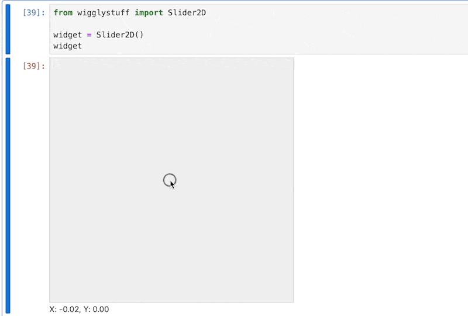

# wigglystuff 


> "A collection of expressive Jupyter widgets."

The project uses [anywidget](https://anywidget.dev/) under the hood so our tools should work in Jupyter, VSCode, Colab *and* [Marimo](https://marimo.io/). That also means that you get a proper widget that can interact with [ipywidgets](https://ipywidgets.readthedocs.io/en/stable/) natively. 

## Installation 

Installation occurs via pip. 

```
python -m pip install wigglystuff
```

## Usage

### `Slider2D`

```python
from wigglystuff import Slider2D

widget = Slider2D()
widget
```



This widget allows you to grab the `widget.x` and `widget.y` properties to get the current position of the slider. But you can also use the `widget.observe` method to listen to changes in the widget. 

<details>
<summary><b>Example of <code>widget.observe</code></b></summary>

```python
import ipywidgets
from wigglystuff import Slider2D

widget = Slider2D()
output = ipywidgets.Output()
state = [[0.0, 0.0]]

@output.capture(clear_output=True)
def on_change(change):
    if abs(widget.x - state[-1][0]) > 0.01:
        if abs(widget.y - state[-1][1]) > 0.01:
            state.append([widget.x, widget.y])
    for elem in state[-5:]:
        print(elem)

widget.observe(on_change)
on_change(None)
ipywidgets.HBox([widget, output])
```
</details>

### `Matrix`

If you want to get an intuition of linear algebra, the `Matrix` object might really help. It can generate a matrix for you that allows you to update all the values in it. 

```python
from wigglystuff import Matrix

arr = Matrix(rows=1, cols=2, step=0.1)
mat = Matrix(matrix=np.eye(2), triangular=True, step=0.1)
```


### `TangleSlider` 

Sliders are neat, but maybe you'd prefer to have something more inline. For that use-case the `TangleSlider` can be just what you need. 

```python
from wigglystuff import TangleSlider
```


### `TangleChoice` 

This is similar to the `TangleSlider` but for discrete choices. 

```python
from wigglystuff import TangleChoice
```

