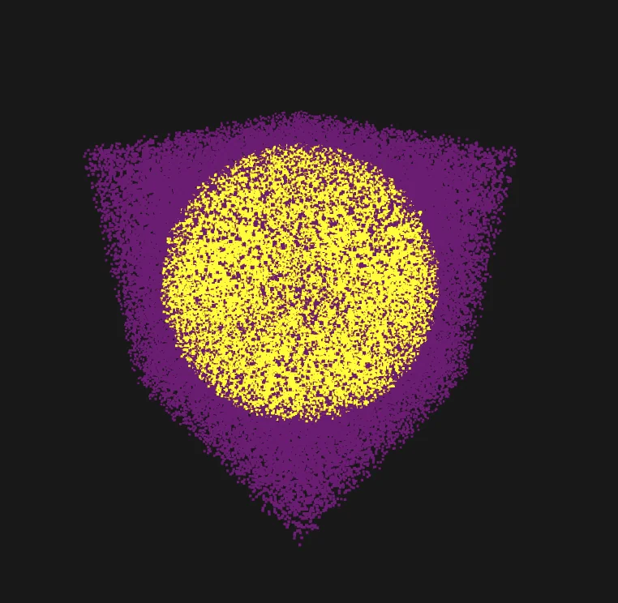
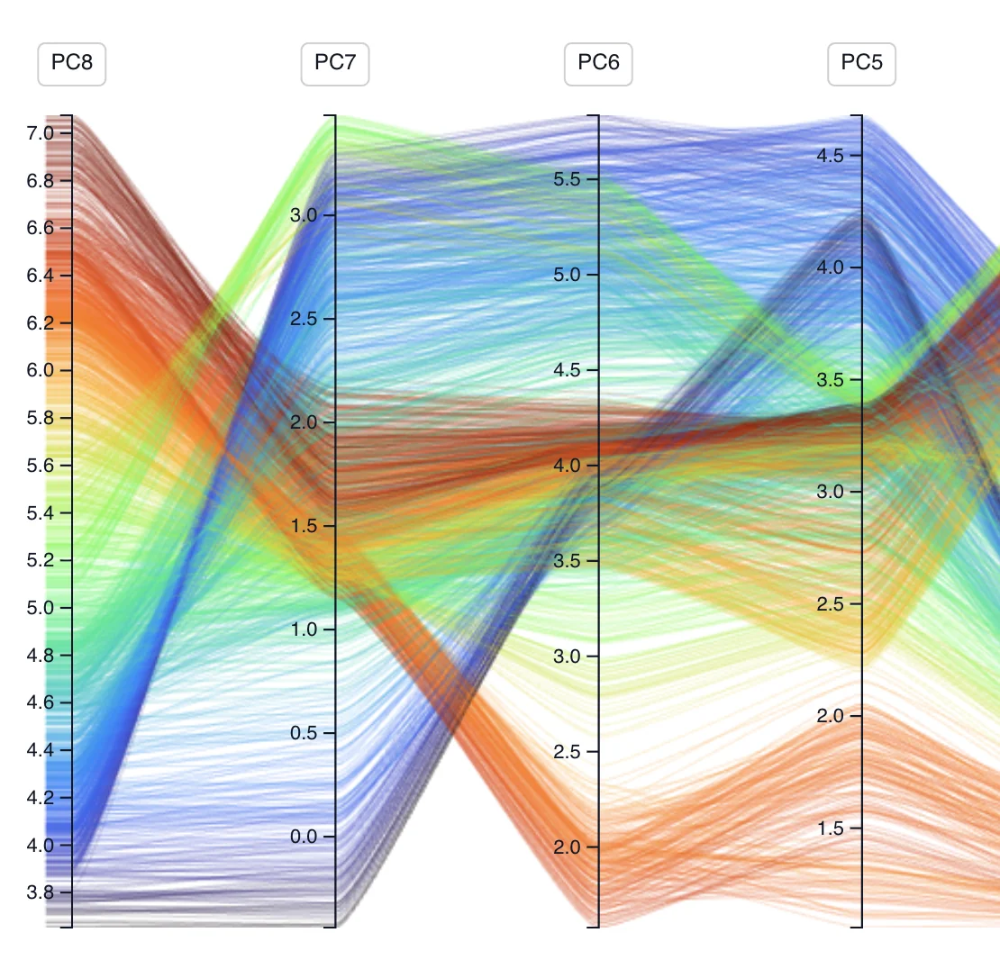
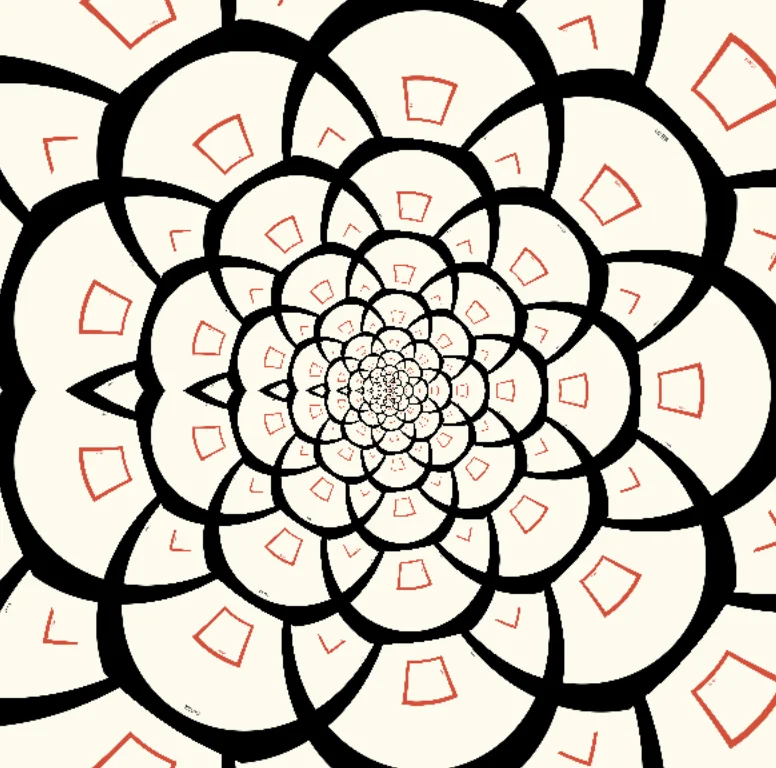
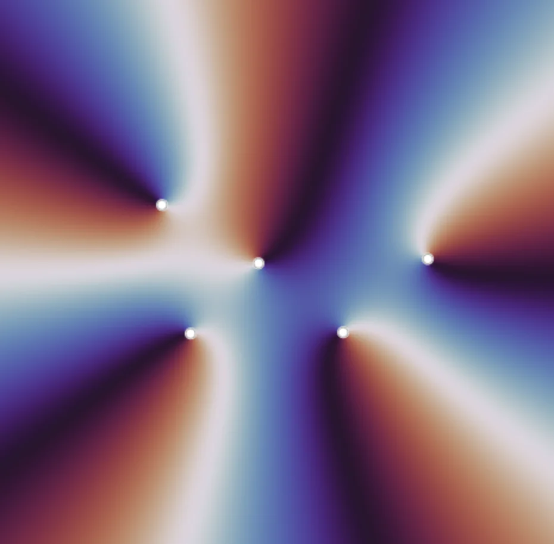
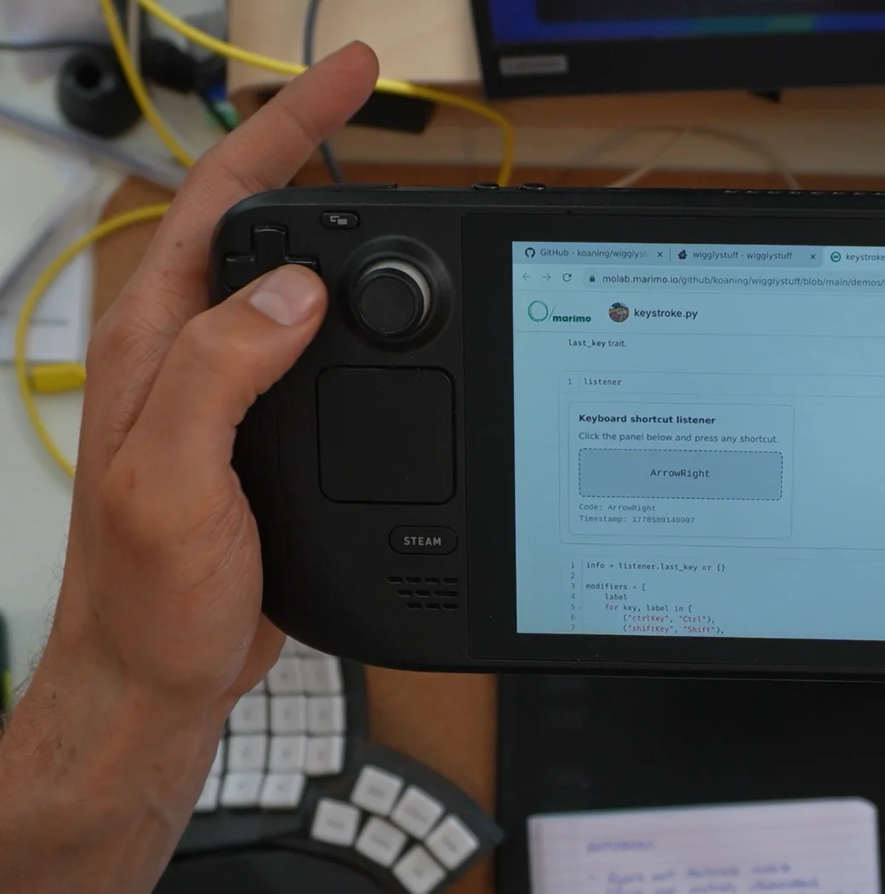
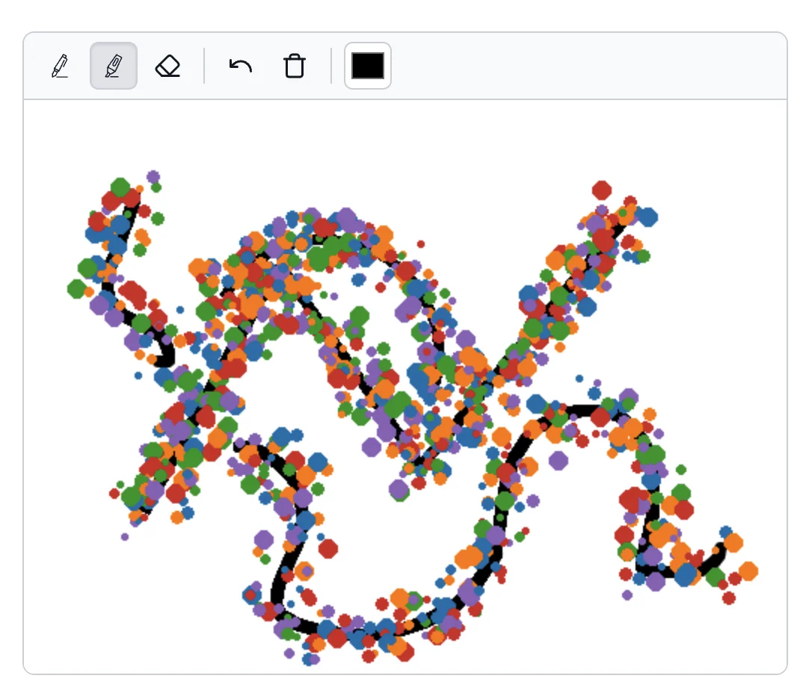
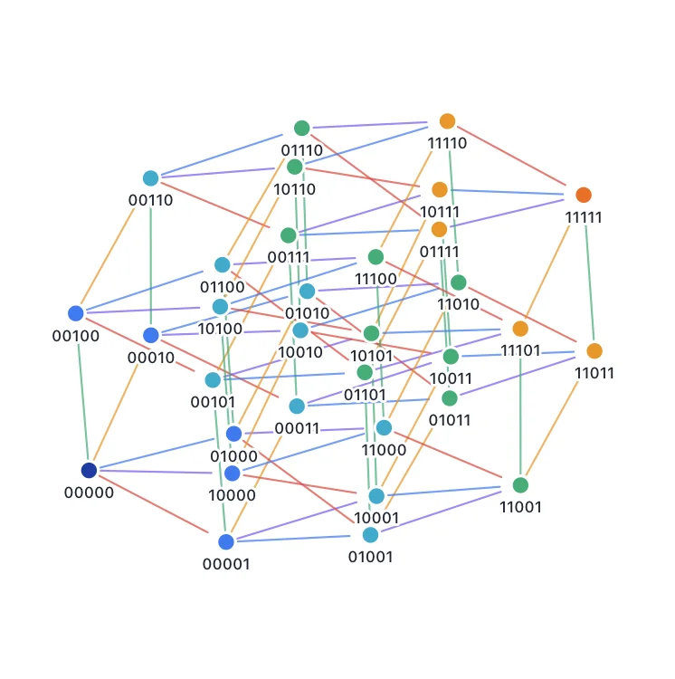
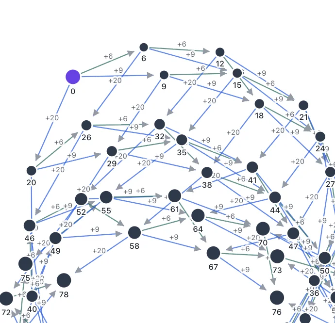
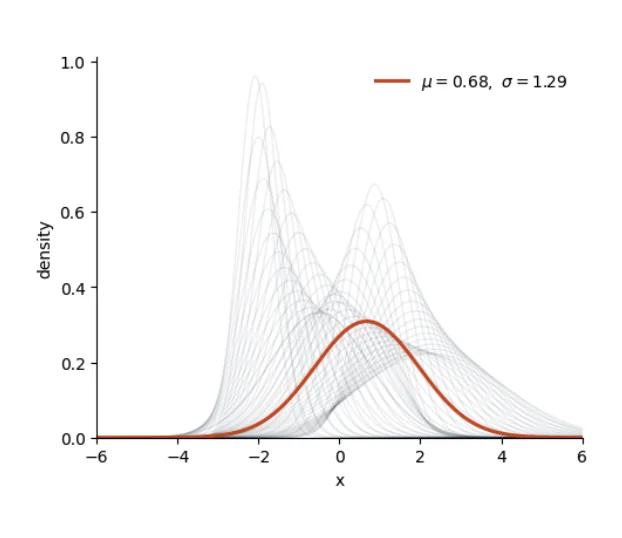
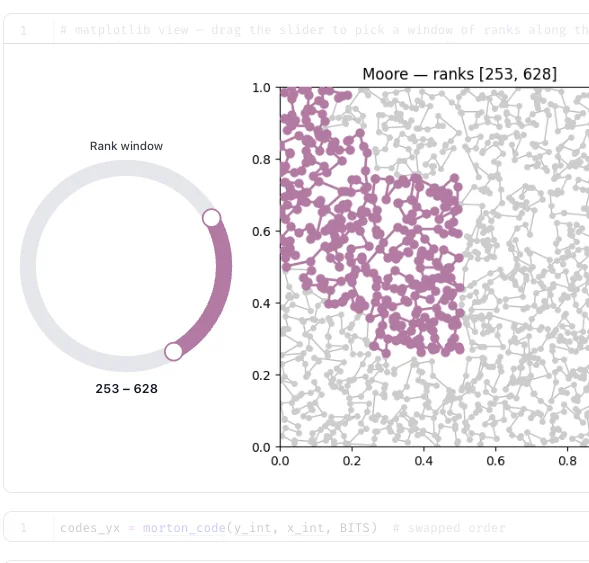

# Wiggly notebooks, zero friction

> "A collection of creative AnyWidgets for Python notebook environments."

## These docs are special 

The documentation for wigglystuff is designed for humans (via hosted marimo notebooks) and robots (via markdown pages to quickly paste into prompts). The reasoning behind this is explained in more detail in [this YT video](https://youtu.be/IgyRh2FuoAk). Follow the links in each example below to find the resources that you're looking for. 

## Install wigglystuff

=== "uv"

    ```bash
    uv pip install wigglystuff
    ```

=== "pip"

    ```bash
    pip install wigglystuff
    ```


## What you can build

<div class="widget-gallery">
<div class="gallery-item">
<div class="gallery-title">Slider2D</div>
<a target="_blank" href="https://molab.marimo.io/github/koaning/wigglystuff/blob/main/demos/slider2d.py/wasm" class="gallery-img"></a>
<div class="gallery-links"><a target="_blank" href="https://molab.marimo.io/github/koaning/wigglystuff/blob/main/demos/slider2d.py/wasm">molab</a><a href="reference/slider2d/">API</a><a href="reference/slider2d.md">MD</a></div>
</div>
<div class="gallery-item">
<div class="gallery-title">BezierCurve</div>
<a target="_blank" href="https://molab.marimo.io/github/koaning/wigglystuff/blob/main/demos/beziercurve.py/wasm" class="gallery-img"></a>
<div class="gallery-links"><a target="_blank" href="https://molab.marimo.io/github/koaning/wigglystuff/blob/main/demos/beziercurve.py/wasm">molab</a><a href="reference/bezier-curve/">API</a><a href="reference/bezier-curve.md">MD</a></div>
</div>
<div class="gallery-item">
<div class="gallery-title">CurveEditor</div>
<a target="_blank" href="https://molab.marimo.io/github/koaning/wigglystuff/blob/main/demos/curveeditor.py/wasm" class="gallery-img"></a>
<div class="gallery-links"><a target="_blank" href="https://molab.marimo.io/github/koaning/wigglystuff/blob/main/demos/curveeditor.py/wasm">molab</a><a href="reference/curve-editor/">API</a><a href="reference/curve-editor.md">MD</a></div>
</div>
<div class="gallery-item">
<div class="gallery-title">Matrix</div>
<a target="_blank" href="https://molab.marimo.io/github/koaning/wigglystuff/blob/main/demos/matrix.py/wasm" class="gallery-img"></a>
<div class="gallery-links"><a target="_blank" href="https://molab.marimo.io/github/koaning/wigglystuff/blob/main/demos/matrix.py/wasm">molab</a><a href="reference/matrix/">API</a><a href="reference/matrix.md">MD</a></div>
</div>
<div class="gallery-item">
<div class="gallery-title">Paint</div>
<a target="_blank" href="https://molab.marimo.io/github/koaning/wigglystuff/blob/main/demos/paint.py/wasm" class="gallery-img"></a>
<div class="gallery-links"><a target="_blank" href="https://molab.marimo.io/github/koaning/wigglystuff/blob/main/demos/paint.py/wasm">molab</a><a href="reference/paint/">API</a><a href="reference/paint.md">MD</a></div>
</div>
<div class="gallery-item">
<div class="gallery-title">Excalidraw</div>
<a target="_blank" href="https://molab.marimo.io/github/koaning/wigglystuff/blob/main/demos/excalidraw.py/wasm" class="gallery-img"></a>
<div class="gallery-links"><a target="_blank" href="https://molab.marimo.io/github/koaning/wigglystuff/blob/main/demos/excalidraw.py/wasm">molab</a><a href="reference/excalidraw/">API</a><a href="reference/excalidraw.md">MD</a></div>
</div>
<div class="gallery-item">
<div class="gallery-title">ThreeWidget</div>
<a target="_blank" href="https://molab.marimo.io/github/koaning/wigglystuff/blob/main/demos/threewidget.py/wasm" class="gallery-img"></a>
<div class="gallery-links"><a target="_blank" href="https://molab.marimo.io/github/koaning/wigglystuff/blob/main/demos/threewidget.py/wasm">molab</a><a href="reference/three-widget/">API</a><a href="reference/three-widget.md">MD</a></div>
</div>
<div class="gallery-item">
<div class="gallery-title">EdgeDraw</div>
<a target="_blank" href="https://molab.marimo.io/github/koaning/wigglystuff/blob/main/demos/edgedraw.py/wasm" class="gallery-img"></a>
<div class="gallery-links"><a target="_blank" href="https://molab.marimo.io/github/koaning/wigglystuff/blob/main/demos/edgedraw.py/wasm">molab</a><a href="reference/edge-draw/">API</a><a href="reference/edge-draw.md">MD</a></div>
</div>
<div class="gallery-item">
<div class="gallery-title">GraphWidget</div>
<a target="_blank" href="https://molab.marimo.io/github/koaning/wigglystuff/blob/main/demos/graphwidget.py/wasm" class="gallery-img"></a>
<div class="gallery-links"><a target="_blank" href="https://molab.marimo.io/github/koaning/wigglystuff/blob/main/demos/graphwidget.py/wasm">molab</a><a href="reference/graph-widget/">API</a><a href="reference/graph-widget.md">MD</a></div>
</div>
<div class="gallery-item">
<div class="gallery-title">SortableList</div>
<a target="_blank" href="https://molab.marimo.io/github/koaning/wigglystuff/blob/main/demos/sortlist.py/wasm" class="gallery-img"></a>
<div class="gallery-links"><a target="_blank" href="https://molab.marimo.io/github/koaning/wigglystuff/blob/main/demos/sortlist.py/wasm">molab</a><a href="reference/sortable-list/">API</a><a href="reference/sortable-list.md">MD</a></div>
</div>
<div class="gallery-item">
<div class="gallery-title">ColorPicker</div>
<a target="_blank" href="https://molab.marimo.io/github/koaning/wigglystuff/blob/main/demos/colorpicker.py/wasm" class="gallery-img"></a>
<div class="gallery-links"><a target="_blank" href="https://molab.marimo.io/github/koaning/wigglystuff/blob/main/demos/colorpicker.py/wasm">molab</a><a href="reference/color-picker/">API</a><a href="reference/color-picker.md">MD</a></div>
</div>
<div class="gallery-item">
<div class="gallery-title">HoverZoom</div>
<a target="_blank" href="https://molab.marimo.io/github/koaning/wigglystuff/blob/main/demos/hoverzoom.py/wasm" class="gallery-img"></a>
<div class="gallery-links"><a target="_blank" href="https://molab.marimo.io/github/koaning/wigglystuff/blob/main/demos/hoverzoom.py/wasm">molab</a><a href="reference/hover-zoom/">API</a><a href="reference/hover-zoom.md">MD</a></div>
</div>
<div class="gallery-item">
<div class="gallery-title">GamepadWidget</div>
<a target="_blank" href="https://molab.marimo.io/github/koaning/wigglystuff/blob/main/demos/gamepad.py/wasm" class="gallery-img"></a>
<div class="gallery-links"><a target="_blank" href="https://molab.marimo.io/github/koaning/wigglystuff/blob/main/demos/gamepad.py/wasm">molab</a><a href="reference/gamepad/">API</a><a href="reference/gamepad.md">MD</a></div>
</div>
<div class="gallery-item">
<div class="gallery-title">KeystrokeWidget</div>
<a target="_blank" href="https://molab.marimo.io/github/koaning/wigglystuff/blob/main/demos/keystroke.py/wasm" class="gallery-img"></a>
<div class="gallery-links"><a target="_blank" href="https://molab.marimo.io/github/koaning/wigglystuff/blob/main/demos/keystroke.py/wasm">molab</a><a href="reference/keystroke/">API</a><a href="reference/keystroke.md">MD</a></div>
</div>
<div class="gallery-item">
<div class="gallery-title">SpeechToText</div>
<a target="_blank" href="https://molab.marimo.io/github/koaning/wigglystuff/blob/main/demos/talk.py/wasm" class="gallery-img"></a>
<div class="gallery-links"><a target="_blank" href="https://molab.marimo.io/github/koaning/wigglystuff/blob/main/demos/talk.py/wasm">molab</a><a href="reference/talk/">API</a><a href="reference/talk.md">MD</a></div>
</div>
<div class="gallery-item">
<div class="gallery-title">CopyToClipboard</div>
<a target="_blank" href="https://molab.marimo.io/github/koaning/wigglystuff/blob/main/demos/copytoclipboard.py/wasm" class="gallery-img"></a>
<div class="gallery-links"><a target="_blank" href="https://molab.marimo.io/github/koaning/wigglystuff/blob/main/demos/copytoclipboard.py/wasm">molab</a><a href="reference/copy-to-clipboard/">API</a><a href="reference/copy-to-clipboard.md">MD</a></div>
</div>
<div class="gallery-item">
<div class="gallery-title">CellTour</div>
<a target="_blank" href="https://molab.marimo.io/github/koaning/wigglystuff/blob/main/demos/celltour.py/wasm" class="gallery-img"></a>
<div class="gallery-links"><a target="_blank" href="https://molab.marimo.io/github/koaning/wigglystuff/blob/main/demos/celltour.py/wasm">molab</a><a href="reference/cell-tour/">API</a><a href="reference/cell-tour.md">MD</a></div>
</div>
<div class="gallery-item">
<div class="gallery-title">WebcamCapture</div>
<a target="_blank" href="https://molab.marimo.io/github/koaning/wigglystuff/blob/main/demos/webcam_capture.py/wasm" class="gallery-img"></a>
<div class="gallery-links"><a target="_blank" href="https://molab.marimo.io/github/koaning/wigglystuff/blob/main/demos/webcam_capture.py/wasm">molab</a><a href="reference/webcam-capture/">API</a><a href="reference/webcam-capture.md">MD</a></div>
</div>
<div class="gallery-item">
<div class="gallery-title">ImageRefreshWidget</div>
<a target="_blank" href="https://molab.marimo.io/github/koaning/wigglystuff/blob/main/demos/htmlwidget.py/wasm" class="gallery-img"></a>
<div class="gallery-links"><a target="_blank" href="https://molab.marimo.io/github/koaning/wigglystuff/blob/main/demos/htmlwidget.py/wasm">molab</a><a href="reference/image-refresh/">API</a><a href="reference/image-refresh.md">MD</a></div>
</div>
<div class="gallery-item">
<div class="gallery-title">HTMLRefreshWidget</div>
<a target="_blank" href="https://molab.marimo.io/github/koaning/wigglystuff/blob/main/demos/htmlwidget.py/wasm" class="gallery-img"></a>
<div class="gallery-links"><a target="_blank" href="https://molab.marimo.io/github/koaning/wigglystuff/blob/main/demos/htmlwidget.py/wasm">molab</a><a href="reference/html-refresh/">API</a><a href="reference/html-refresh.md">MD</a></div>
</div>
<div class="gallery-item">
<div class="gallery-title">ProgressBar</div>
<a target="_blank" href="https://molab.marimo.io/github/koaning/wigglystuff/blob/main/demos/progressbar.py/wasm" class="gallery-img"></a>
<div class="gallery-links"><a target="_blank" href="https://molab.marimo.io/github/koaning/wigglystuff/blob/main/demos/progressbar.py/wasm">molab</a><a href="reference/progress-bar/">API</a><a href="reference/progress-bar.md">MD</a></div>
</div>
<div class="gallery-item">
<div class="gallery-title">RidgelineChart</div>
<a target="_blank" href="https://molab.marimo.io/github/koaning/wigglystuff/blob/main/demos/ridgelinechart.py/wasm" class="gallery-img"></a>
<div class="gallery-links"><a target="_blank" href="https://molab.marimo.io/github/koaning/wigglystuff/blob/main/demos/ridgelinechart.py/wasm">molab</a><a href="reference/ridgeline-chart/">API</a><a href="reference/ridgeline-chart.md">MD</a></div>
</div>
<div class="gallery-item">
<div class="gallery-title">TextCompare</div>
<a target="_blank" href="https://molab.marimo.io/github/koaning/wigglystuff/blob/main/demos/textcompare.py/wasm" class="gallery-img"></a>
<div class="gallery-links"><a target="_blank" href="https://molab.marimo.io/github/koaning/wigglystuff/blob/main/demos/textcompare.py/wasm">molab</a><a href="reference/text-compare/">API</a><a href="reference/text-compare.md">MD</a></div>
</div>
<div class="gallery-item">
<div class="gallery-title">EnvConfig</div>
<a target="_blank" href="https://molab.marimo.io/github/koaning/wigglystuff/blob/main/demos/envconfig.py/wasm" class="gallery-img"></a>
<div class="gallery-links"><a target="_blank" href="https://molab.marimo.io/github/koaning/wigglystuff/blob/main/demos/envconfig.py/wasm">molab</a><a href="reference/env-config/">API</a><a href="reference/env-config.md">MD</a></div>
</div>
<div class="gallery-item">
<div class="gallery-title">Tangle</div>
<a target="_blank" href="https://molab.marimo.io/github/koaning/wigglystuff/blob/main/demos/tangle.py/wasm" class="gallery-img"></a>
<div class="gallery-links"><a target="_blank" href="https://molab.marimo.io/github/koaning/wigglystuff/blob/main/demos/tangle.py/wasm">molab</a><a href="reference/tangle/">API</a><a href="reference/tangle.md">MD</a></div>
</div>
<div class="gallery-item">
<div class="gallery-title">ChartPuck</div>
<a target="_blank" href="https://molab.marimo.io/github/koaning/wigglystuff/blob/main/demos/chartpuck.py/wasm" class="gallery-img"></a>
<div class="gallery-links"><a target="_blank" href="https://molab.marimo.io/github/koaning/wigglystuff/blob/main/demos/chartpuck.py/wasm">molab</a><a href="reference/chart-puck/">API</a><a href="reference/chart-puck.md">MD</a></div>
</div>
<div class="gallery-item">
<div class="gallery-title">ChartMultiSelect</div>
<a target="_blank" href="https://molab.marimo.io/github/koaning/wigglystuff/blob/main/demos/chartmultiselect.py/wasm" class="gallery-img"></a>
<div class="gallery-links"><a target="_blank" href="https://molab.marimo.io/github/koaning/wigglystuff/blob/main/demos/chartmultiselect.py/wasm">molab</a><a href="reference/chart-multi-select/">API</a><a href="reference/chart-multi-select.md">MD</a></div>
</div>
<div class="gallery-item">
<div class="gallery-title">ChartSelect</div>
<a target="_blank" href="https://molab.marimo.io/github/koaning/wigglystuff/blob/main/demos/chartselect.py/wasm" class="gallery-img"></a>
<div class="gallery-links"><a target="_blank" href="https://molab.marimo.io/github/koaning/wigglystuff/blob/main/demos/chartselect.py/wasm">molab</a><a href="reference/chart-select/">API</a><a href="reference/chart-select.md">MD</a></div>
</div>
<div class="gallery-item">
<div class="gallery-title">ParallelCoordinates</div>
<a target="_blank" href="https://molab.marimo.io/github/koaning/wigglystuff/blob/main/demos/parallelcoords.py/wasm" class="gallery-img"></a>
<div class="gallery-links"><a target="_blank" href="https://molab.marimo.io/github/koaning/wigglystuff/blob/main/demos/parallelcoords.py/wasm">molab</a><a href="reference/parallel-coords/">API</a><a href="reference/parallel-coords.md">MD</a></div>
</div>
<div class="gallery-item">
<div class="gallery-title">ScatterWidget</div>
<a target="_blank" href="https://molab.marimo.io/github/koaning/wigglystuff/blob/main/demos/scatterwidget.py/wasm" class="gallery-img"></a>
<div class="gallery-links"><a target="_blank" href="https://molab.marimo.io/github/koaning/wigglystuff/blob/main/demos/scatterwidget.py/wasm">molab</a><a href="reference/scatter-widget/">API</a><a href="reference/scatter-widget.md">MD</a></div>
</div>
<div class="gallery-item">
<div class="gallery-title">SplineDraw</div>
<a target="_blank" href="https://molab.marimo.io/github/koaning/wigglystuff/blob/main/demos/splinedraw.py/wasm" class="gallery-img"></a>
<div class="gallery-links"><a target="_blank" href="https://molab.marimo.io/github/koaning/wigglystuff/blob/main/demos/splinedraw.py/wasm">molab</a><a href="reference/spline-draw/">API</a><a href="reference/spline-draw.md">MD</a></div>
</div>
<div class="gallery-item">
<div class="gallery-title">ApiDoc</div>
<a target="_blank" href="https://molab.marimo.io/github/koaning/wigglystuff/blob/main/demos/apidoc.py/wasm" class="gallery-img"></a>
<div class="gallery-links"><a target="_blank" href="https://molab.marimo.io/github/koaning/wigglystuff/blob/main/demos/apidoc.py/wasm">molab</a><a href="reference/api-doc/">API</a><a href="reference/api-doc.md">MD</a></div>
</div>
<div class="gallery-item">
<div class="gallery-title">AnnotationWidget</div>
<a target="_blank" href="https://molab.marimo.io/github/koaning/wigglystuff/blob/main/demos/annotation.py/wasm" class="gallery-img"></a>
<div class="gallery-links"><a target="_blank" href="https://molab.marimo.io/github/koaning/wigglystuff/blob/main/demos/annotation.py/wasm">molab</a><a href="reference/annotation/">API</a><a href="reference/annotation.md">MD</a></div>
</div>
<div class="gallery-item">
<div class="gallery-title">PlaySlider</div>
<a target="_blank" href="https://molab.marimo.io/github/koaning/wigglystuff/blob/main/demos/play_slider.py/wasm" class="gallery-img"></a>
<div class="gallery-links"><a target="_blank" href="https://molab.marimo.io/github/koaning/wigglystuff/blob/main/demos/play_slider.py/wasm">molab</a><a href="reference/play-slider/">API</a><a href="reference/play-slider.md">MD</a></div>
</div>
<div class="gallery-item">
<div class="gallery-title">CircularSlider</div>
<a target="_blank" href="https://molab.marimo.io/github/koaning/wigglystuff/blob/main/demos/circular_slider.py/wasm" class="gallery-img"></a>
<div class="gallery-links"><a target="_blank" href="https://molab.marimo.io/github/koaning/wigglystuff/blob/main/demos/circular_slider.py/wasm">molab</a><a href="reference/circular-slider/">API</a><a href="reference/circular-slider.md">MD</a></div>
</div>
<div class="gallery-item">
<div class="gallery-title">ForecastChart</div>
<a target="_blank" href="https://molab.marimo.io/github/koaning/wigglystuff/blob/main/demos/forecast_chart.py/wasm" class="gallery-img"></a>
<div class="gallery-links"><a target="_blank" href="https://molab.marimo.io/github/koaning/wigglystuff/blob/main/demos/forecast_chart.py/wasm">molab</a><a href="reference/utils/">API</a><a href="reference/utils.md">MD</a></div>
</div>
<div class="gallery-item">
<div class="gallery-title">Treemap</div>
<a target="_blank" href="https://molab.marimo.io/github/koaning/wigglystuff/blob/main/demos/treemap.py/wasm" class="gallery-img"></a>
<div class="gallery-links"><a target="_blank" href="https://molab.marimo.io/github/koaning/wigglystuff/blob/main/demos/treemap.py/wasm">molab</a><a href="reference/treemap/">API</a><a href="reference/treemap.md">MD</a></div>
</div>
<div class="gallery-item">
<div class="gallery-title">NestedTable</div>
<a target="_blank" href="https://molab.marimo.io/github/koaning/wigglystuff/blob/main/demos/nested_table.py/wasm" class="gallery-img"></a>
<div class="gallery-links"><a target="_blank" href="https://molab.marimo.io/github/koaning/wigglystuff/blob/main/demos/nested_table.py/wasm">molab</a><a href="reference/nested-table/">API</a><a href="reference/nested-table.md">MD</a></div>
</div>
</div>

Each widget links to a live demo on [molab](https://molab.marimo.io) where you can interact with and edit the notebook directly in your browser.

## 3rd party widgets

These widgets depend on 3rd party packages. They still ship with wigglystuff but have demos hosted on [molab](https://molab.marimo.io) because many of the dependencies are not compatible with WASM.

<div class="widget-gallery">
<div class="gallery-item">
<div class="gallery-title">ModuleTreeWidget</div>
<a target="_blank" href="https://molab.marimo.io/notebooks/nb_K7QvvoASZErgKxwD8XSMWi" class="gallery-img"></a>
<div class="gallery-links"><a target="_blank" href="https://molab.marimo.io/notebooks/nb_K7QvvoASZErgKxwD8XSMWi">molab</a><a href="reference/module-tree/">API</a><a href="reference/module-tree.md">MD</a></div>
</div>
<div class="gallery-item">
<div class="gallery-title">Neo4jWidget</div>
<a target="_blank" href="https://molab.marimo.io/notebooks/nb_ghifaw8nRCuDAgc1UTajXU" class="gallery-img"></a>
<div class="gallery-links"><a target="_blank" href="https://molab.marimo.io/notebooks/nb_ghifaw8nRCuDAgc1UTajXU">molab</a><a href="reference/neo4j-widget/">API</a><a href="reference/neo4j-widget.md">MD</a></div>
</div>
<div class="gallery-item">
<div class="gallery-title">AltairWidget</div>
<a target="_blank" href="https://molab.marimo.io/github/koaning/wigglystuff/blob/main/demos/altairwidget.py" class="gallery-img"></a>
<div class="gallery-links"><a target="_blank" href="https://molab.marimo.io/github/koaning/wigglystuff/blob/main/demos/altairwidget.py">molab</a><a href="reference/altair-widget/">API</a><a href="reference/altair-widget.md">MD</a></div>
</div>
</div>

## Examples

These notebooks show how to combine multiple widgets for more complex workflows.

<div class="example-gallery">
<div class="example-item">
<a target="_blank" href="https://molab.marimo.io/github/koaning/wigglystuff/blob/main/demos/dimensions.py" class="example-img"></a>
<div class="example-content">
<div class="example-title">Dimensions</div>
<div class="example-desc">Explore high-dimensional data with parallel coordinates and interactive scatter plots.</div>
</div>
<div class="gallery-links"><a target="_blank" href="https://molab.marimo.io/github/koaning/wigglystuff/blob/main/demos/dimensions.py">molab</a><a target="_blank" href="https://github.com/koaning/wigglystuff/blob/main/demos/dimensions.py">Source</a></div>
</div>
<div class="example-item">
<a target="_blank" href="https://molab.marimo.io/github/koaning/wigglystuff/blob/main/demos/fashion-mnist-parallel-coords.py" class="example-img"></a>
<div class="example-content">
<div class="example-title">Fashion MNIST</div>
<div class="example-desc">Visualize Fashion MNIST embeddings with parallel coordinates filtering.</div>
</div>
<div class="gallery-links"><a target="_blank" href="https://molab.marimo.io/github/koaning/wigglystuff/blob/main/demos/fashion-mnist-parallel-coords.py">molab</a><a target="_blank" href="https://github.com/koaning/wigglystuff/blob/main/demos/fashion-mnist-parallel-coords.py">Source</a></div>
</div>
<div class="example-item">
<a target="_blank" href="https://molab.marimo.io/github/koaning/wigglystuff/blob/main/demos/zooming.py" class="example-img"></a>
<div class="example-content">
<div class="example-title">Infinite Zoom</div>
<div class="example-desc">A 3Blue1Brown-inspired Droste effect simulator using the Paint widget with conformal mapping.</div>
</div>
<div class="gallery-links"><a target="_blank" href="https://molab.marimo.io/github/koaning/wigglystuff/blob/main/demos/zooming.py">molab</a><a target="_blank" href="https://github.com/koaning/wigglystuff/blob/main/demos/zooming.py">Source</a></div>
</div>
<div class="example-item">
<a target="_blank" href="https://molab.marimo.io/notebooks/nb_qUrxbhdkek5FCCSfQiZzFU" class="example-img"></a>
<div class="example-content">
<div class="example-title">Complex Plane Roots</div>
<div class="example-desc">Move polynomial roots interactively and watch the phase singularities follow. By Simone Conradi.</div>
</div>
<div class="gallery-links"><a target="_blank" href="https://molab.marimo.io/notebooks/nb_qUrxbhdkek5FCCSfQiZzFU">molab</a></div>
</div>
<div class="example-item">
<a target="_blank" href="https://molab.marimo.io/github/koaning/wigglystuff/blob/main/demos/steamdeck.py" class="example-img"></a>
<div class="example-content">
<div class="example-title">Steam Deck Annotations</div>
<div class="example-desc">Use Steam Input to map Steam Deck buttons to keyboard keys, then drive AnnotationWidget through its keyboard_mapping — with a KeystrokeWidget section for inspecting what each button emits.</div>
</div>
<div class="gallery-links"><a target="_blank" href="https://molab.marimo.io/github/koaning/wigglystuff/blob/main/demos/steamdeck.py">molab</a><a target="_blank" href="https://github.com/koaning/wigglystuff/blob/main/demos/steamdeck.py/wasm">Source</a></div>
</div>
<div class="example-item">
<a target="_blank" href="https://molab.marimo.io/github/koaning/wigglystuff/blob/main/demos/paint-scatter.py/wasm" class="example-img"></a>
<div class="example-content">
<div class="example-title">Paint Scatter</div>
<div class="example-desc">Draw on a Paint canvas and watch a marimo refresh-driven loop bloom colorful dots around every dark stroke also includes a colored Conway's Game of Life.</div>
</div>
<div class="gallery-links"><a target="_blank" href="https://molab.marimo.io/github/koaning/wigglystuff/blob/main/demos/paint-scatter.py/wasm">molab</a><a target="_blank" href="https://github.com/koaning/wigglystuff/blob/main/demos/paint-scatter.pywasm">Source</a></div>
</div>
<div class="example-item">
<a target="_blank" href="https://molab.marimo.io/github/koaning/wigglystuff/blob/main/demos/hypercube.py/wasm" class="example-img"></a>
<div class="example-content">
<div class="example-title">Hypercube</div>
<div class="example-desc">Generate the n-dimensional hypercubeprogrammatically and watch GraphWidget's force layout unfurl it.</div>
</div>
<div class="gallery-links"><a target="_blank" href="https://molab.marimo.io/github/koaning/wigglystuff/blob/main/demos/hypercube.py/wasm">molab</a><a target="_blank" href="https://github.com/koaning/wigglystuff/blob/main/demos/hypercube.py/wasm">Source</a></div>
</div>
<div class="example-item">
<a target="_blank" href="https://molab.marimo.io/github/koaning/wigglystuff/blob/main/demos/mcnugget_graph.py/wasm" class="example-img"></a>
<div class="example-content">
<div class="example-title">McNugget Graph</div>
<div class="example-desc">Step through a breadth-first search of which integers you can reach by summing McNugget box sizes (6, 9, 20), visualized with GraphWidget and driven by PlaySlider.</div>
</div>
<div class="gallery-links"><a target="_blank" href="https://molab.marimo.io/github/koaning/wigglystuff/blob/main/demos/mcnugget_graph.py/wasm">molab</a><a target="_blank" href="https://github.com/koaning/wigglystuff/blob/main/demos/mcnugget_graph.py/wasm">Source</a></div>
</div>
<div class="example-item">
<a target="_blank" href="https://molab.marimo.io/github/koaning/wigglystuff/blob/main/demos/curve_normal.py" class="example-img"></a>
<div class="example-content">
<div class="example-title">Curve Normal</div>
<div class="example-desc">Treat the CurveEditor's chart space as the (μ, σ) parameter space of a normal distribution — drag knots through it and watch the family of densities update from the samples traitlet.</div>
</div>
<div class="gallery-links"><a target="_blank" href="https://molab.marimo.io/github/koaning/wigglystuff/blob/main/demos/curve_normal.py">molab</a><a target="_blank" href="https://github.com/koaning/wigglystuff/blob/main/demos/curve_normal.py/wasm">Source</a></div>
</div>
<div class="example-item">
<a target="_blank" href="https://molab.marimo.io/github/koaning/wigglystuff/blob/main/demos/curve-filling.py" class="example-img"></a>
<div class="example-content">
<div class="example-title">Space-Filling Curves</div>
<div class="example-desc">Compare Morton, Hilbert, and Moore curves, then drag the seamless CircularRangeSlider to highlight a wrapping window of ranks along the curve.</div>
</div>
<div class="gallery-links"><a target="_blank" href="https://molab.marimo.io/github/koaning/wigglystuff/blob/main/demos/curve-filling.py">molab</a><a target="_blank" href="https://github.com/koaning/wigglystuff/blob/main/demos/curve-filling.py/wasm">Source</a></div>
</div>
</div>
