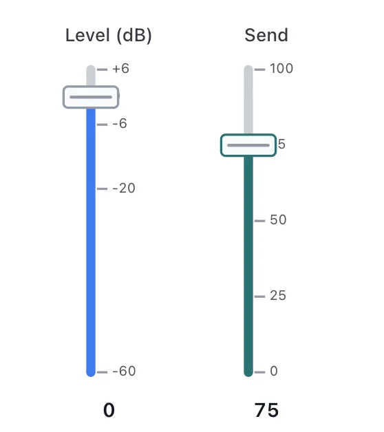

# Fader API

<!-- no-md -->

<button class="wiggly-demo" type="button" data-demo="fader" data-demo-title="Fader live demo">

Run this demo live in your browser ▶
</button>

<!-- /no-md -->

`Fader` is a linear slider drawn to look like a channel fader on a mixing
console: a cap slides along a slot, with a configurable tick scale (e.g. dB
marks) alongside the track. It is vertical by default with `max_value` at the
top; pass `orientation="horizontal"` for a left-to-right fader.

Ticks are configurable — `ticks=N` for evenly spaced marks, a list of values, or
`(value, label)` pairs. Pass `steps` instead for a **stepped fader** that snaps
to discrete detents. With `midi=True` the fader shows a "MIDI learn" button:
click it, move a control on your hardware, and the next control-change message
binds to the fader (Web MIDI, Chromium browsers). The binding is remembered in
browser localStorage so it survives a restart.

See also: [Knob](knob.md) for the rotary console version, and
[HoverSlider](hover-slider.md) for a linear slider that also reports the value
under the pointer.

::: wigglystuff.fader.Fader

## Synced traitlets

| Traitlet | Type | Notes |
| --- | --- | --- |
| `value` | `float` | Current value, mapped along the track. |
| `min_value` | `float` | Lower bound (bottom / left). |
| `max_value` | `float` | Upper bound (top / right). |
| `step` | `float` | Snap increment in value units (continuous mode). |
| `ticks` | `list[dict]` | Normalized `{"value", "label"}` tick marks. |
| `steps` | `list[float]` | Discrete detents to snap to; empty means continuous. |
| `orientation` | `str` | `"vertical"` (default) or `"horizontal"`. |
| `length` | `int` | Track length in pixels (the long dimension). |
| `label` | `str` | Optional text label shown above the fader. |
| `show_value` | `bool` | Render the current value as text next to the fader. |
| `color` | `str` | CSS color for the filled track and cap. Empty follows the theme. |
| `midi` | `bool` | Show the MIDI-learn button and listen for control-change. |
| `midi_cc` | `int` | Bound control-change number (0-127), or `-1` when unbound. |
| `midi_channel` | `int` | Bound MIDI channel (0-15), or `-1` for any. |
| `midi_device` | `str` | Name of the bound MIDI input device. |
| `midi_supported` | `bool` | Whether the browser exposes Web MIDI (set from JS). |
| `midi_learning` | `bool` | Whether the fader is currently in learn mode. |
| `midi_key` | `str` | localStorage key for the persisted binding (defaults to `label`). |
| `midi_scope` | `str` | Namespace for the binding; empty uses the browser URL path. |
