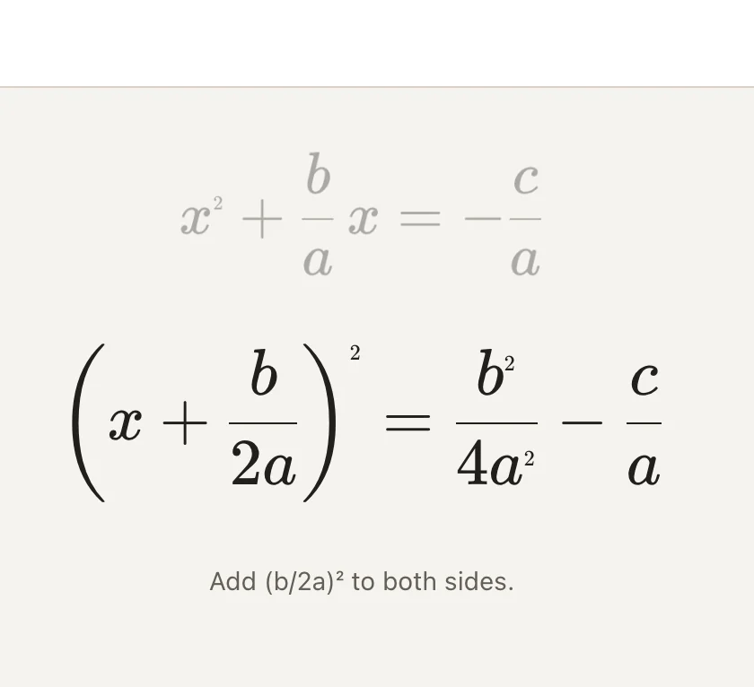

# FormulaAnimation API

<!-- no-md -->

<button class="wiggly-demo" type="button" data-demo="formula_animation" data-demo-title="FormulaAnimation live demo">

Run this demo live in your browser ▶
</button>

<!-- /no-md -->

`FormulaAnimation` steps through a LaTeX derivation one line at a time. Give it a
list of `{"tex": ..., "note": ...}` dicts and the current line sits centered while
the previous line floats above it dimmed, with a short caption under the active
line. Playback is manual: move with the built-in prev/next buttons, with the arrow
keys (click the widget to opt into keyboard control), or by driving the reactive
`step` trait from Python — for example, an `mo.ui.slider` in another cell. With
`spotlight=True` a final step frames the finished formula alone in an elevated
card. The `steps` list is plain JSON, so an LLM can emit a derivation directly.

See also: [TangleLatex](tangle-latex.md) for a single formula with draggable
numbers, and [FramePlayer](frame-player.md) for stepping through a sequence of
rendered images.

::: wigglystuff.formula_animation.FormulaAnimation

## Synced traitlets

| Traitlet | Type | Notes |
| --- | --- | --- |
| `steps` | `list[dict]` | Normalized `{"tex": str, "note": str}` derivation lines. |
| `title` | `str \| None` | Optional heading rendered above the animation. |
| `spotlight` | `bool` | Append a final step framing the last formula alone. |
| `step` | `int` | Current index; reactive, slider-drivable, moved by buttons/keys. |
| `height` | `int` | Height of the animation stage in pixels. |
| `theme` | `str` | `"auto"`, `"light"`, or `"dark"`. |
| `error` | `str` | Set if KaTeX fails to load in the browser. |
