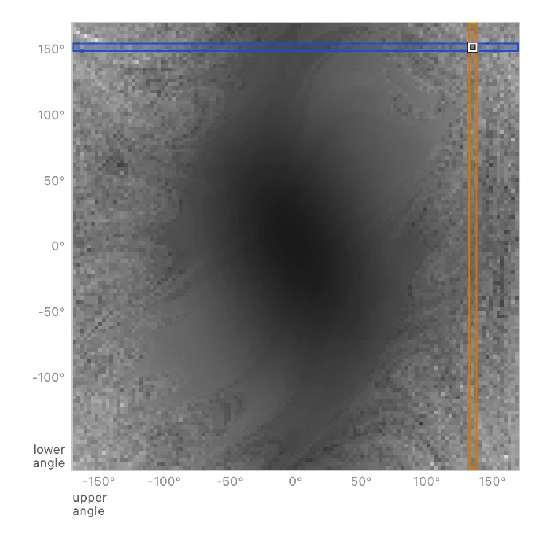

# HeatmapSelect API

<!-- no-md -->
<div class="wiggly-demo-wrap">
<button class="wiggly-demo" type="button" data-demo="heatmap_select" data-demo-title="HeatmapSelect live demo">

<span class="wiggly-demo__cta">Run this demo live in your browser <span class="wiggly-demo__play">▶</span></span>
</button>
</div>
<!-- /no-md -->

`HeatmapSelect` renders a 2D array as a dense grid — one image pixel per cell, in the
spirit of the parameter spaces in Bret Victor's
[*Up and Down the Ladder of Abstraction*](https://worrydream.com/LadderOfAbstraction/).
Hover or click a cell in the body to pick one point of the sweep, or grab the left or
bottom gutter to pin a whole row or column. The three pins are independent and coexist, so
you can hold a cell, a row and a column at once. The values behind the picture never cross
the wire: the widget reports indices and you do the slicing, which is what lets a 14 641-cell
field stay a single PNG. Reach for it when a sweep has two knobs and you want to see the runs
behind any slice of it.

See also: [ChartSelect](chart-select.md) for box and lasso selection over a matplotlib
figure, [ChartPuck](chart-puck.md) for dragging a single point across a chart, and
[Slider2D](slider2d.md) for picking a continuous `(x, y)` pair rather than a grid cell.

::: wigglystuff.heatmap_select.HeatmapSelect

## Synced traitlets

| Traitlet | Type | Notes |
| --- | --- | --- |
| `image_base64` | `str` | The grid bitmap as a PNG data URI. One image pixel is one cell. |
| `n_rows` | `int` | Grid rows, derived from the image height. |
| `n_cols` | `int` | Grid columns, derived from the image width. |
| `x_range` | `tuple[float, float]` | Data coordinates of the first and last *column* centers. |
| `y_range` | `tuple[float, float]` | Data coordinates of the first and last *row* centers. |
| `x_label` | `str` | Label under the bottom gutter. May contain `\n` to stack lines. |
| `y_label` | `str` | Label beside the left gutter. May contain `\n` to stack lines. |
| `x_suffix` | `str` | Appended to x tick labels, e.g. `"°"`. |
| `y_suffix` | `str` | Appended to y tick labels. |
| `origin` | `str` | `"lower"` puts image row 0 at the bottom (like `imshow`), `"upper"` at the top. |
| `cell_width` | `int` | Screen pixels per cell horizontally. |
| `cell_height` | `int` | Screen pixels per cell vertically. |
| `row_color` | `str` | Tint for the row band from the left (y) axis. Empty uses `--hs-row-color`. |
| `col_color` | `str` | Tint for the column band from the bottom (x) axis. Empty uses `--hs-col-color`. |
| `pinned_cell` | `tuple[int, int] \| None` | `(row, col)` of the pinned cell. |
| `pinned_row` | `int \| None` | Row index pinned from the left axis. |
| `pinned_col` | `int \| None` | Column index pinned from the bottom axis. |
| `hover_cell` | `tuple[int, int] \| None` | `(row, col)` under the cursor, when it is over the grid body. |
| `hover_row` | `int \| None` | Row under the cursor, when it is over the left gutter. |
| `hover_col` | `int \| None` | Column under the cursor, when it is over the bottom gutter. |
| `throttle` | `int \| str` | Hover sync rate. `0` = every move, int = ms, `"dragend"` = on release. Pin changes always sync immediately. |

## Interaction

| Gesture | Result |
| --- | --- |
| Hover the body | Sets `hover_cell`. |
| Hover the left gutter | Sets `hover_row` — a horizontal band. |
| Hover the bottom gutter | Sets `hover_col` — a vertical band. |
| Click (anywhere, including a gutter) | Pins that region. Only that region's pin is replaced. |
| Drag | Keeps moving that region's pin. |
| Double-click a region | Drops only that region's pin. |
| Mouse out | Clears the hover traits; pins are untouched. |

The three pins are independent, so a cell, a row and a column can all be held at
once. Hovering never disturbs a pin — it draws a faint ghost instead.

## Coloring

Pass a 2D numeric array and the widget colormaps it with matplotlib's own
conventions: `cmap` (a name or a `Colormap`), `norm`, `vmin`, `vmax`. The default
is grayscale. Cells that are **masked or non-finite** take the colormap's "bad"
color, which is all you need for a crash region:

```python
import matplotlib
import numpy as np
from wigglystuff import HeatmapSelect

HeatmapSelect(
    np.ma.masked_where(crashed, distance),
    cmap=matplotlib.colormaps["gray"].with_extremes(bad="red"),
)
```

Autoscaling is relative, exactly as with `imshow`: uniformly rescaling the data
produces an identical picture. Pin `vmin`/`vmax` if you need an absolute scale
across successive `set_image` calls.

You can also skip colormapping entirely and hand over a finished picture — a PIL
image, an `(rows, cols, 3|4)` uint8 array, a path, or a base64 PNG.

## Sizing

The plot size is *derived*: `n_cols * cell_width` by `n_rows * cell_height`. Cells
are therefore always whole pixel blocks and never shimmer, which is why there is
no `width`/`height` argument — both are read-only properties.
