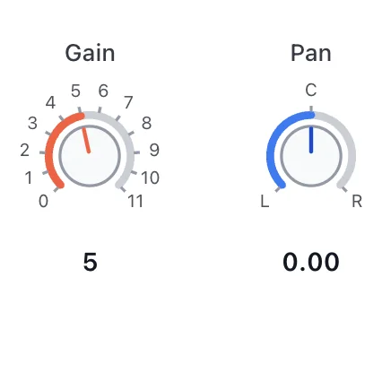

# Knob API

<!-- no-md -->

<button class="wiggly-demo" type="button" data-demo="knob" data-demo-title="Knob live demo">

Run this demo live in your browser ▶
</button>

<!-- /no-md -->

`Knob` is a rotary control that looks like a knob on a synth or mixing console.
Unlike [CircularSlider](circular-slider.md) (a full 360° ring), it sweeps a
partial arc with a gap at the bottom by default, with a pointer showing the
current position. Angles are measured in degrees clockwise from 12 o'clock, so
the default `start_angle=-135` / `end_angle=135` gives the classic 270° sweep;
pass a full `start_angle=0, end_angle=360` for a gapless dial that wraps.

Ticks are configurable — `ticks=N` for evenly spaced marks, a list of values, or
`(value, label)` pairs. Pass `steps` instead for a **rotary selector** that snaps
to discrete detents (numbers or named positions). With `midi=True` the knob shows
a "MIDI learn" button: click it, move a control on your hardware, and the next
control-change message binds to the knob (Web MIDI, Chromium browsers). The
binding is remembered in browser localStorage so it survives a restart.

See also: [Fader](fader.md) for the linear console version, and
[CircularSlider](circular-slider.md) for a full-ring dial.

::: wigglystuff.knob.Knob

## Synced traitlets

| Traitlet | Type | Notes |
| --- | --- | --- |
| `value` | `float` | Current value, mapped across the arc. |
| `min_value` | `float` | Lower bound (at `start_angle`). |
| `max_value` | `float` | Upper bound (at `end_angle`). |
| `step` | `float` | Snap increment in value units (continuous mode). |
| `start_angle` | `float` | Angle of `min_value`, degrees clockwise from 12 o'clock. |
| `end_angle` | `float` | Angle of `max_value`; a 360° span makes a full circle. |
| `ticks` | `list[dict]` | Normalized `{"value", "label"}` tick marks. |
| `steps` | `list[float]` | Discrete detents to snap to; empty means continuous. |
| `size` | `int` | Diameter in pixels. |
| `label` | `str` | Optional text label shown above the knob. |
| `show_value` | `bool` | Render the current value as text below the knob. |
| `color` | `str` | CSS color for the value arc and pointer. Empty follows the theme. |
| `midi` | `bool` | Show the MIDI-learn button and listen for control-change. |
| `midi_cc` | `int` | Bound control-change number (0-127), or `-1` when unbound. |
| `midi_channel` | `int` | Bound MIDI channel (0-15), or `-1` for any. |
| `midi_device` | `str` | Name of the bound MIDI input device. |
| `midi_supported` | `bool` | Whether the browser exposes Web MIDI (set from JS). |
| `midi_learning` | `bool` | Whether the knob is currently in learn mode. |
| `midi_key` | `str` | localStorage key for the persisted binding (defaults to `label`). |
| `midi_scope` | `str` | Namespace for the binding; empty uses the browser URL path. |
