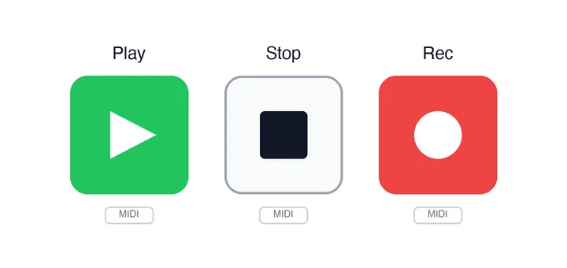

# MidiButton API

<!-- no-md -->

<button class="wiggly-demo" type="button" data-demo="midi_button" data-demo-title="MidiButton live demo">

Run this demo live in your browser ▶
</button>

<!-- /no-md -->

`MidiButton` is a pad you can press on-screen or bind to a hardware MIDI pad.
Where [Knob](knob.md) and [Fader](fader.md) learn a continuous control-change,
`MidiButton` learns a MIDI **note** — the message a drum pad or launch button
sends — and turns presses into an event or a latched state.

Pick `mode="momentary"` (the default; `value` is `True` only while held) or
`mode="toggle"` (each press flips `value`). Every press also bumps
`press_timestamp`, so an `observe` handler fires even on repeated presses, and
`velocity` carries the note-on velocity (0-127; on-screen clicks send 127).

Put a glyph on the face with `icon`: a built-in name (`play`, `pause`, `stop`,
`record`, `skip-back`, `skip-forward`, `circle`, `square`, `triangle`, `heart`,
`star`, `bell`, `zap`, `check`, `x`, `plus`, `minus`, `power`, `mic`, `music`),
or any emoji/text rendered literally. With an `icon` set, `label` becomes a
caption above the pad; with no icon, `label` renders on the face.

MIDI is on by default: the pad shows a "MIDI learn" chip — click it, hit a pad
on your hardware, and the next note-on binds to this button (Web MIDI, Chromium
browsers). The binding is remembered in browser localStorage so it survives a
restart. Pass `midi=False` for a plain on-screen pad; read the binding back via
`midi_note` / `midi_channel` / `midi_device`.

See also: [Knob](knob.md) and [Fader](fader.md) for the continuous-CC members of
the same MIDI-learn family.

::: wigglystuff.midi_button.MidiButton

## Synced traitlets

| Traitlet | Type | Notes |
| --- | --- | --- |
| `value` | `bool` | Pressed (momentary) or on/off (toggle) state. |
| `press_timestamp` | `float` | Bumped on every press so `observe` fires on repeats. |
| `velocity` | `int` | Note-on velocity (0-127) of the last press; 127 for a click. |
| `label` | `str` | Caption above the pad, or the face text when no icon. |
| `icon` | `str` | Built-in icon name, or any emoji/text for the face. |
| `mode` | `str` | `"momentary"` or `"toggle"`. |
| `size` | `int` | Pad size in pixels (square). |
| `color` | `str` | CSS color for the active pad. Empty follows the theme. |
| `midi` | `bool` | Show the MIDI-learn chip and listen for notes. |
| `midi_note` | `int` | Bound note number (0-127), or `-1` when unbound. |
| `midi_channel` | `int` | Bound MIDI channel (0-15), or `-1` for any. |
| `midi_device` | `str` | Name of the bound MIDI input device. |
| `midi_supported` | `bool` | Whether the browser exposes Web MIDI (set from JS). |
| `midi_learning` | `bool` | Whether the pad is currently in learn mode. |
| `midi_key` | `str` | localStorage key for the persisted binding (defaults to `label`). |
| `midi_scope` | `str` | Namespace for the binding; empty uses the browser URL path. |
