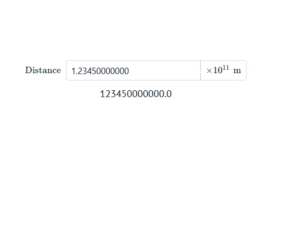

# ScientificNumber API

<!-- no-md -->
<div class="wiggly-demo-wrap">
<button class="wiggly-demo" type="button" data-demo="scientific_number" data-demo-title="ScientificNumber live demo">

<span class="wiggly-demo__cta">Run this demo live in your browser <span class="wiggly-demo__play">▶</span></span>
</button>
</div>
<!-- /no-md -->

`ScientificNumber` is a text field for numbers across the full magnitude
spectrum. Type plain decimals (`0.0001`) or scientific notation (`1e-30`)
straight in — no more entering 20 zeros — and add an optional `scale` factor so
Python reads back a value that's already rescaled for you. The box displays the
raw value you typed (`raw_value`); when you access the value from Python
(`value`, or its alias `scaled_value`) the scale is already applied.

It can also display the scale and even show units. You have to keep track of the
scale that gets applied to the Python value and the displayed `scale_label`
yourself — they're independent because of the units: write a scale label of
`1e+3` with the unit meter, or just write kilometer. Pass `step` to snap the
raw input and `min`/`max` to clamp the scaled value.

::: wigglystuff.scientific_number.ScientificNumber

## Wrap it in marimo

In marimo, always reach the widget through `mo.ui.anywidget(...)` — that is the
object marimo watches, so cells that read `widget.value[...]` or `widget.raw_value`
re-run whenever the input changes:

```python
# Cell 1
distance = mo.ui.anywidget(
    ScientificNumber(
        label="$\\text{Distance}$",
        unit_label="$\\text{m}$",
        scale=1e11,
        scale_label="$\\times 10^{11}$",
        value=1.496e11,
    )
)

# Cell 2
mo.md(f"distance = {distance.scaled_value} m")
```

## Synced traitlets

| Traitlet       | Type                   | Notes                                                                                                                                  |
| -------------- | ---------------------- | -------------------------------------------------------------------------------------------------------------------------------------- |
| `value`        | `int \| float`         | Raw input multiplied by `scale`. This is the number you read in Python.                                                                |
| `scaled_value` | `int \| float`         | Alias of `value`, for reading the scaled number out of `mo.ui.anywidget(...).value["scaled_value"]`.                                   |
| `raw_value`    | `int \| float`         | What was typed, after snapping (`step`) and clamping (`min`/`max`).                                                                    |
| `label`        | `str`                  | Optional label shown left of the box. Plain text, or `$...$` for KaTeX. Empty hides it.                                                |
| `unit_label`   | `str`                  | Unit text shown in the right panel. Plain text, or `$...$` for KaTeX.                                                                  |
| `scale`        | `float`                | Multiplier applied to the raw input to produce `value`.                                                                                |
| `scale_label`  | `str`                  | Text shown in the right panel for the scale. Plain text, or `$...$` for KaTeX. Display-only; keep it consistent with `scale` yourself. |
| `step`         | `int \| float \| None` | Snap increment applied to the raw input. `None` disables snapping.                                                                     |
| `min`          | `int \| float \| None` | Lower bound on the scaled `value`. `None` means unbounded.                                                                             |
| `max`          | `int \| float \| None` | Upper bound on the scaled `value`. `None` means unbounded.                                                                             |
| `width`        | `int`                  | Widget width in pixels.                                                                                                                |
| `notation`     | `str`                  | Display format for the value: `"decimal"` (default) or `"scientific"`.                                                                 |
| `inline_mode`  | `bool`                 | Compact text-height rendering for use inside `mo.md`; set via `.inline()`.                                                             |
