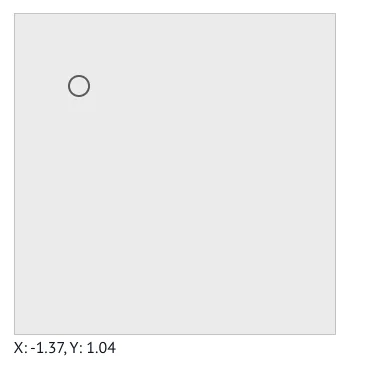

# Slider2D API

<!-- no-md -->

<button class="wiggly-demo" type="button" data-demo="slider2d" data-demo-title="Slider2D live demo">

Run this demo live in your browser ▶
</button>

<!-- /no-md -->

`Slider2D` renders a square canvas with a draggable dot and syncs its `x` and `y`
position back to Python, so a single gesture steers two parameters at once — in
Jupyter, marimo, Colab, or anything else that speaks AnyWidget.

See also: [ChartPuck](chart-puck.md) for dragging a puck over a matplotlib chart,
[CircularSlider](circular-slider.md) for a single-value dial, and
[Matrix](matrix.md) for editing a whole grid of numbers.

::: wigglystuff.slider2d.Slider2D

## Synced traitlets

| Traitlet | Type | Notes |
| --- | --- | --- |
| `x` | `float` | Current x position. |
| `y` | `float` | Current y position. |
| `x_bounds` | `tuple[float, float]` | Min/max x bounds. |
| `y_bounds` | `tuple[float, float]` | Min/max y bounds. |
| `width` | `int` | Canvas width in pixels. |
| `height` | `int` | Canvas height in pixels. |
