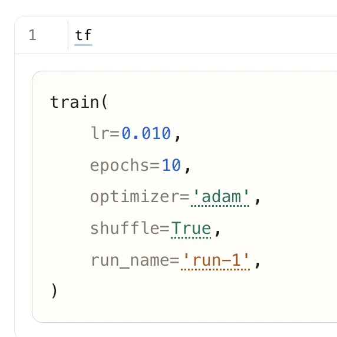

# TangleFunction API

<!-- no-md -->

<button class="wiggly-demo" type="button" data-demo="tangle_function" data-demo-title="TangleFunction live demo">

Run this demo live in your browser ▶
</button>

<!-- /no-md -->

`TangleFunction` introspects a function's type hints and defaults and renders it
as a clean call expression such as `train(lr=0.01, epochs=10, optimizer='adam')`.
Numbers drag horizontally to scrub (and click to type an exact value),
`Literal`/`Enum`/`bool` arguments click to cycle through their known options, and
strings are click-to-edit. The live arguments land in `values`, ready to splat
into the function with `fn(**tf.value["values"])`.

Numbers are unbounded scrubbers by default. Give one a range or a step by
annotating it with [`annotated_types`](https://pypi.org/project/annotated-types/)
constraints (`Ge`, `Le`, `Gt`, `Lt`, `MultipleOf`) — the same constraints
pydantic uses, so `pydantic.Field(ge=..., le=...)` works too — or with a
`params=` override.

See also: [TangleLatex](tangle-latex.md) for the same drag gesture inside a LaTeX
formula, and [Tangle widgets](tangle.md) for individual inline sliders and
choices in plain prose.

::: wigglystuff.tangle_function.TangleFunction

## Synced traitlets

| Traitlet | Type | Notes |
| --- | --- | --- |
| `fn_name` | `str` | The function's name, shown before the opening parenthesis. |
| `parameters` | `dict` | Per-parameter render spec (kind, options/bounds/step/digits). |
| `param_order` | `list` | Parameter names in signature order. |
| `values` | `dict` | Live current value for each parameter; splat into the function. |
| `theme` | `str` | `"auto"`, `"light"`, or `"dark"`. |
| `width` | `int` | Max width in pixels before the expression wraps one arg per line. |
| `error` | `str` | Validation/render error surfaced from the widget. |
