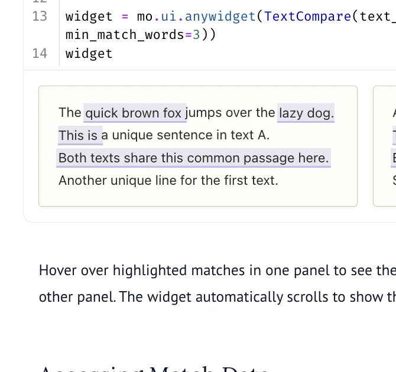

# TextCompare API

<!-- no-md -->

<button class="wiggly-demo" type="button" data-demo="textcompare" data-demo-title="TextCompare live demo">

Run this demo live in your browser ▶
</button>

<!-- /no-md -->

`TextCompare` shows two texts in side-by-side panels and highlights every run of matching
words, with `min_match_words` setting how long a run has to be before it counts. Hover a
highlight and the other panel scrolls to the same passage, which is what makes shared or
lifted text quick to spot between two documents. The `matches` traitlet hands the same
list back to Python with start and end offsets and a word count per match.

See also: [HoverZoom](hover-zoom.md) for inspecting image detail with the same hover
gesture, [LiveEdit](live-edit.md) for reading a Python run instead of prose, and
[ApiDoc](api-doc.md) for putting reference text next to the code it describes.

::: wigglystuff.text_compare.TextCompare

## Synced traitlets

| Traitlet | Type | Notes |
| --- | --- | --- |
| `text_a` | `str` | First text to compare. |
| `text_b` | `str` | Second text to compare. |
| `matches` | `list` | List of detected matches, each with start_a, end_a, start_b, end_b, text, and word_count. |
| `selected_match` | `int` | Index of the currently hovered match (-1 if none). |
| `min_match_words` | `int` | Minimum consecutive words to consider a match (default: 3). |
