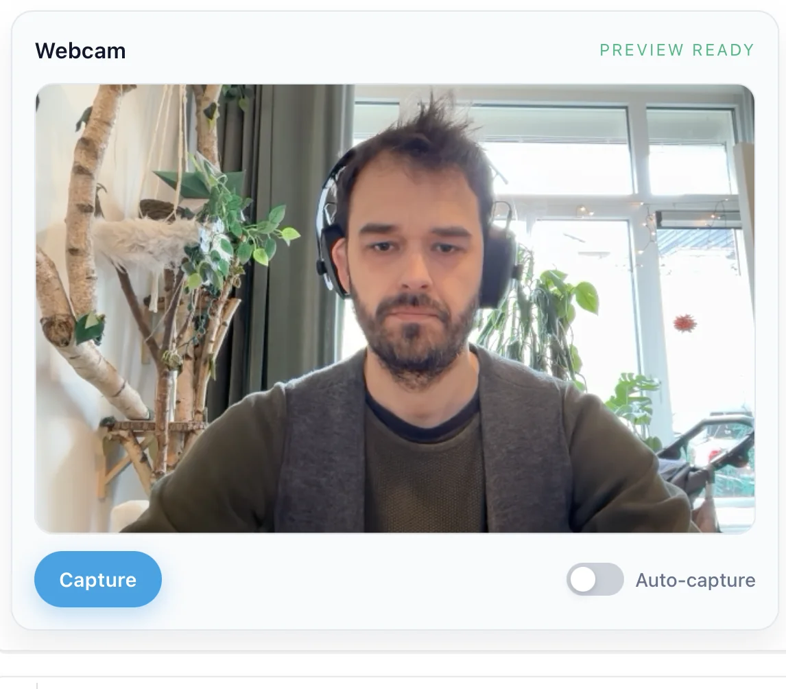

# WebcamCapture API

<!-- no-md -->

<button class="wiggly-demo" type="button" data-demo="webcam_capture" data-demo-title="WebcamCapture live demo">

Run this demo live in your browser ▶
</button>

<!-- /no-md -->

`WebcamCapture` puts a live camera preview in the notebook with a capture button and an
auto-capture toggle. Each snapshot lands in `image_base64`, and `get_pil()` or
`get_bytes()` turn it into something a model can eat. Set `interval_ms` and flip
`capturing` to pull frames on a cadence — enough to run inference on a rough video
stream. `facing_mode` picks the front or rear camera; `error` reports refused access.

See also: [Paint](paint.md) for drawing on a canvas instead of photographing one,
[HoverZoom](hover-zoom.md) for inspecting a captured frame up close, and
[FramePlayer](frame-player.md) for replaying a run of captures as a loop.

::: wigglystuff.webcam_capture.WebcamCapture

## Synced traitlets

| Traitlet | Type | Notes |
| --- | --- | --- |
| `image_base64` | `str` | PNG data URL for the latest frame. |
| `capturing` | `bool` | Enable auto-capture mode. |
| `interval_ms` | `int` | Auto-capture interval in milliseconds. |
| `facing_mode` | `str` | Camera facing mode ("user" or "environment"). |
| `ready` | `bool` | True when the preview stream is ready. |
| `error` | `str` | Error message when webcam access fails. |

