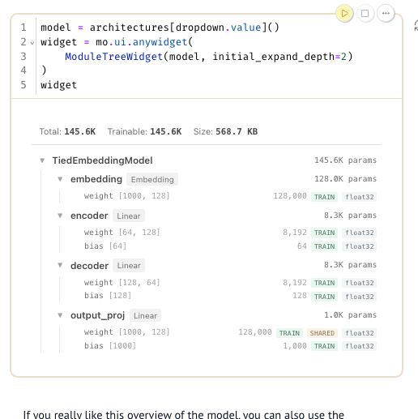

# Wiggly notebooks, zero friction

> "A collection of creative AnyWidgets for Python notebook environments."

## These docs are special 

The documentation for wigglystuff is designed for humans (via hosted marimo notebooks) and robots (via markdown pages to quickly paste into prompts). The reasoning behind this is explained in more detail in [this YT video](https://youtu.be/IgyRh2FuoAk). Follow the links in each example below to find the resources that you're looking for. 

## Install wigglystuff

=== "uv"

    ```bash
    uv pip install wigglystuff
    ```

=== "pip"

    ```bash
    pip install wigglystuff
    ```


## What you can build

<div class="widget-gallery">
<div class="gallery-item">
<div class="gallery-title">Slider2D</div>
<a href="examples/slider2d/" class="gallery-img"></a>
<div class="gallery-links"><a href="examples/slider2d/">Demo</a><a href="reference/slider2d/">API</a><a href="reference/slider2d.md">MD</a></div>
</div>
<div class="gallery-item">
<div class="gallery-title">Matrix</div>
<a href="examples/matrix/" class="gallery-img"></a>
<div class="gallery-links"><a href="examples/matrix/">Demo</a><a href="reference/matrix/">API</a><a href="reference/matrix.md">MD</a></div>
</div>
<div class="gallery-item">
<div class="gallery-title">Paint</div>
<a href="examples/paint/" class="gallery-img"></a>
<div class="gallery-links"><a href="examples/paint/">Demo</a><a href="reference/paint/">API</a><a href="reference/paint.md">MD</a></div>
</div>
<div class="gallery-item">
<div class="gallery-title">ThreeWidget</div>
<a href="examples/threewidget/" class="gallery-img"></a>
<div class="gallery-links"><a href="examples/threewidget/">Demo</a><a href="reference/three-widget/">API</a><a href="reference/three-widget.md">MD</a></div>
</div>
<div class="gallery-item">
<div class="gallery-title">EdgeDraw</div>
<a href="examples/edgedraw/" class="gallery-img"></a>
<div class="gallery-links"><a href="examples/edgedraw/">Demo</a><a href="reference/edge-draw/">API</a><a href="reference/edge-draw.md">MD</a></div>
</div>
<div class="gallery-item">
<div class="gallery-title">SortableList</div>
<a href="examples/sortlist/" class="gallery-img"></a>
<div class="gallery-links"><a href="examples/sortlist/">Demo</a><a href="reference/sortable-list/">API</a><a href="reference/sortable-list.md">MD</a></div>
</div>
<div class="gallery-item">
<div class="gallery-title">ColorPicker</div>
<a href="examples/colorpicker/" class="gallery-img"></a>
<div class="gallery-links"><a href="examples/colorpicker/">Demo</a><a href="reference/color-picker/">API</a><a href="reference/color-picker.md">MD</a></div>
</div>
<div class="gallery-item">
<div class="gallery-title">GamepadWidget</div>
<a href="examples/gamepad/" class="gallery-img"></a>
<div class="gallery-links"><a href="examples/gamepad/">Demo</a><a href="reference/gamepad/">API</a><a href="reference/gamepad.md">MD</a></div>
</div>
<div class="gallery-item">
<div class="gallery-title">KeystrokeWidget</div>
<a href="examples/keystroke/" class="gallery-img"></a>
<div class="gallery-links"><a href="examples/keystroke/">Demo</a><a href="reference/keystroke/">API</a><a href="reference/keystroke.md">MD</a></div>
</div>
<div class="gallery-item">
<div class="gallery-title">SpeechToText</div>
<a href="examples/talk/" class="gallery-img"></a>
<div class="gallery-links"><a href="examples/talk/">Demo</a><a href="reference/talk/">API</a><a href="reference/talk.md">MD</a></div>
</div>
<div class="gallery-item">
<div class="gallery-title">CopyToClipboard</div>
<a href="examples/copytoclipboard/" class="gallery-img"></a>
<div class="gallery-links"><a href="examples/copytoclipboard/">Demo</a><a href="reference/copy-to-clipboard/">API</a><a href="reference/copy-to-clipboard.md">MD</a></div>
</div>
<div class="gallery-item">
<div class="gallery-title">CellTour</div>
<a href="examples/celltour/" class="gallery-img"></a>
<div class="gallery-links"><a href="examples/celltour/">Demo</a><a href="reference/cell-tour/">API</a><a href="reference/cell-tour.md">MD</a></div>
</div>
<div class="gallery-item">
<div class="gallery-title">WebcamCapture</div>
<a href="examples/webcam-capture/" class="gallery-img"></a>
<div class="gallery-links"><a href="examples/webcam-capture/">Demo</a><a href="reference/webcam-capture/">API</a><a href="reference/webcam-capture.md">MD</a></div>
</div>
<div class="gallery-item">
<div class="gallery-title">ImageRefreshWidget</div>
<a href="examples/htmlwidget/" class="gallery-img"></a>
<div class="gallery-links"><a href="examples/htmlwidget/">Demo</a><a href="reference/image-refresh/">API</a><a href="reference/image-refresh.md">MD</a></div>
</div>
<div class="gallery-item">
<div class="gallery-title">HTMLRefreshWidget</div>
<a href="examples/htmlwidget/" class="gallery-img"></a>
<div class="gallery-links"><a href="examples/htmlwidget/">Demo</a><a href="reference/html-refresh/">API</a><a href="reference/html-refresh.md">MD</a></div>
</div>
<div class="gallery-item">
<div class="gallery-title">ProgressBar</div>
<a href="examples/htmlwidget/" class="gallery-img"></a>
<div class="gallery-links"><a href="examples/htmlwidget/">Demo</a><a href="reference/progress-bar/">API</a><a href="reference/progress-bar.md">MD</a></div>
</div>
<div class="gallery-item">
<div class="gallery-title">PulsarChart</div>
<a href="examples/pulsarchart/" class="gallery-img"></a>
<div class="gallery-links"><a href="examples/pulsarchart/">Demo</a><a href="reference/pulsar-chart/">API</a><a href="reference/pulsar-chart.md">MD</a></div>
</div>
<div class="gallery-item">
<div class="gallery-title">TextCompare</div>
<a href="examples/textcompare/" class="gallery-img"></a>
<div class="gallery-links"><a href="examples/textcompare/">Demo</a><a href="reference/text-compare/">API</a><a href="reference/text-compare.md">MD</a></div>
</div>
<div class="gallery-item">
<div class="gallery-title">EnvConfig</div>
<a href="examples/envconfig/" class="gallery-img"></a>
<div class="gallery-links"><a href="examples/envconfig/">Demo</a><a href="reference/env-config/">API</a><a href="reference/env-config.md">MD</a></div>
</div>
<div class="gallery-item">
<div class="gallery-title">Tangle</div>
<a href="examples/tangle/" class="gallery-img"></a>
<div class="gallery-links"><a href="examples/tangle/">Demo</a><a href="reference/tangle/">API</a><a href="reference/tangle.md">MD</a></div>
</div>
<div class="gallery-item">
<div class="gallery-title">ChartPuck</div>
<a href="examples/chartpuck/" class="gallery-img"></a>
<div class="gallery-links"><a href="examples/chartpuck/">Demo</a><a href="reference/chart-puck/">API</a><a href="reference/chart-puck.md">MD</a></div>
</div>
<div class="gallery-item">
<div class="gallery-title">ChartSelect</div>
<a href="examples/chartselect/" class="gallery-img"></a>
<div class="gallery-links"><a href="examples/chartselect/">Demo</a><a href="reference/chart-select/">API</a><a href="reference/chart-select.md">MD</a></div>
</div>
</div>

Each widget page embeds a marimo-powered html-wasm export and links back to the exact notebook that generated the demo, so you can open the original `.py` file and rerun it locally.

## 3rd party widgets

These widgets depend on 3rd party packages. They still ship with wigglystuff but have demos hosted on [molab](https://molab.marimo.io) because many of the dependencies are not compatible with WASM.(https://molab.marimo.io/notebooks/nb_K7QvvoASZErgKxwD8XSMWi).

<div class="widget-gallery">
<div class="gallery-item">
<div class="gallery-title">ModuleTreeWidget</div>
<a href="https://molab.marimo.io/notebooks/nb_K7QvvoASZErgKxwD8XSMWi" class="gallery-img"></a>
<div class="gallery-links"><a href="https://molab.marimo.io/notebooks/nb_K7QvvoASZErgKxwD8XSMWi">Demo</a><a href="reference/module-tree/">API</a><a href="reference/module-tree.md">MD</a></div>
</div>
</div>
